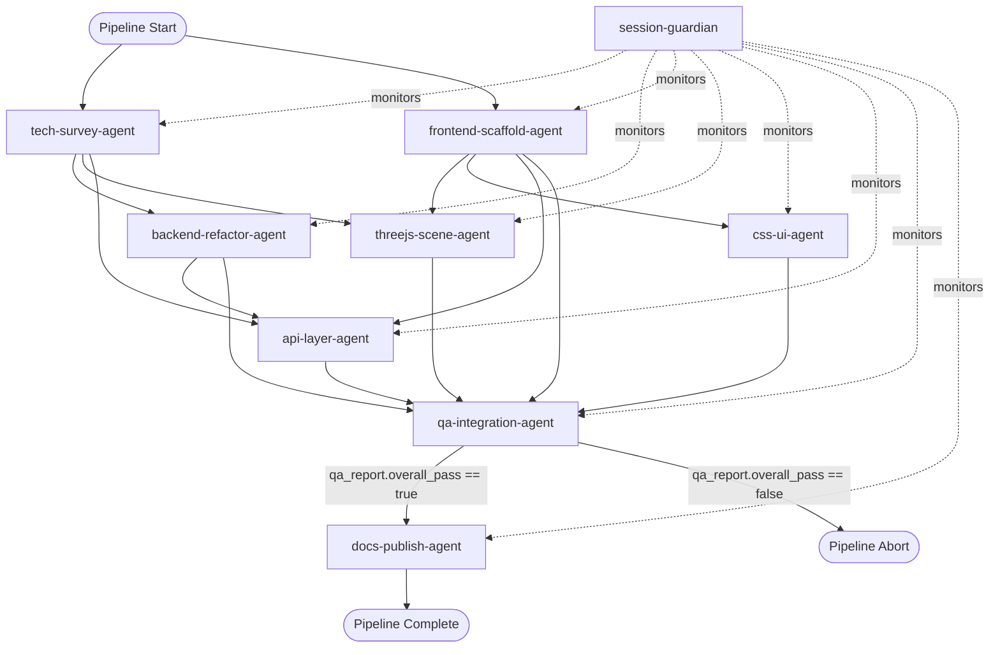

# 千禧年蟲事件 — 網頁前端開發規格書 V2

## Multi-Agent Pipeline 可執行規格

**版本**: v2.0
**日期**: 2026-04-29
**角色**: 遊戲產品經理 + 系統架構師
**目標**: 產出一份 Agent 團隊可直接執行的規格書，消除所有人類解讀依賴

---

# 第一章：產品概述與技術基線

## 1.1 產品名稱
千禧年蟲事件（Millennium Bug Incident）

## 1.2 現有基底
- Python 終端文字冒險遊戲（同步 `print()` / `input()` 迴圈）
- LLM 對話引擎（DeepSeek Pro API，Anthropic 相容介面，`stream=False`）
- 情緒值系統（0-100 float）
- 感染度系統（0-100 float）
- 記憶碎片系統（0-10 int）
- 物品系統（dict-based inventory）
- 屬性系統（dict-based attributes）
- 修理系統（skill-check logic）

## 1.3 後端重構範圍：Level 2 — 通訊層完全重構

### 重構內容
| 項目 | 重構前 | 重構後 |
|------|--------|--------|
| Web 框架 | 無（終端） | FastAPI + uvicorn |
| 通訊協定 | stdin/stdout | HTTP POST + WebSocket |
| LLM 調用 | `stream=False` 同步 | `stream=True` streaming generator |
| 文字輸出 | `print()` 一次性 | WebSocket 逐 token 推送（打字機效果） |
| 玩家輸入 | `input()` 阻塞 | HTTP POST `/api/game/action` 非阻塞 |
| 狀態持久化 | 記憶體 dict | JSON file（`game_state.json`） |
| 背景選擇 | 無 | 後端計算 `scene_trigger` 欄位 |
| 觀看者計數 | 無 | 後端計算 `viewer_count` 欄位 |

### 1.3.1 計數器計算位置：後端計算

```python
def calculate_viewer_count(emotion: float, infection: float, fragments: int, glitch_events: int) -> int:
    base = 1
    if emotion < 20:
        base += int((20 - emotion) // 5)
    if infection > 60:
        base += int((infection - 60) // 10)
    base += fragments
    base += glitch_events
    return min(base, 99)
```

每次 `/api/game/action` 回應包含當前 `viewer_count` 整數值，前端只負責渲染。

### 1.3.2 LLM Streaming 改寫

```python
async def call_llm_stream(prompt: str, history: list) -> AsyncGenerator[str, None]:
    """改寫現有 call_llm() 為 streaming 版本"""
    response = await client.messages.create(
        model=MODEL,
        max_tokens=4096,
        stream=True,  # key change
        messages=build_messages(prompt, history),
    )
    async for chunk in response:
        if chunk.type == "content_block_delta":
            yield chunk.delta.text
```

## 1.4 不可變設計規範（從原 PRD 繼承）

以下規範**直接沿用**，Agent 必須原封不動實現：
- 4 種閾限空間 3D 場景及其觸發邏輯
- 完整色彩體系（11 色票含 Hex/RGB）
- 字體規範（Chicago/Charcoal 像素等效 + 7 段數碼管）
- 6 種 UI 元件設計（視窗面板、按鈕、進度條、計數器、對話框、系統對話框）
- 頁面布局結構（z-index 層級）
- Three.js PS1 Shader 代碼（vertex + fragment）
- CRT 掃描線 CSS 覆蓋層
- AI 生成對沖參數（中英雙語）

---

# 第二章：視覺設計規範（機器可檢查版）

## 2.1 色彩體系（強制調色板）

所有 CSS/JS/SVG 中使用的顏色必須來源於此表，不允許任何其它色碼：

| 變數名 | Hex | RGB | 用途 |
|--------|-----|-----|------|
| `--color-void-black` | `#0A0D14` | (10,13,20) | 頁面背景底色 |
| `--color-shadow-cyan` | `#003344` | (0,51,68) | PS1 陰影色罩 |
| `--color-panel-bg` | `#1A2530` | (26,37,48) | 面板背景 |
| `--color-panel-secondary` | `#2A3540` | (42,53,64) | 次要面板 |
| `--color-sick-green` | `#33FF33` | (51,255,51) | 計數器/游標 |
| `--color-sick-green-dim` | `#1A8C1A` | (26,140,26) | 計數器低亮度模式 |
| `--color-dark-orange` | `#8B4513` | (139,69,19) | 7 段數碼管（暗模式） |
| `--color-cold-cyan` | `#88CCFF` | (136,204,255) | UI 邊框高光 |
| `--color-dark-purple` | `#1A1025` | (26,16,37) | 對話框陰影 |
| `--color-taillight-red` | `#8B0000` | (139,0,0) | 唯一暖色強調 |
| `--color-text-primary` | `#C0C0C0` | (192,192,192) | 主要文字 |
| `--color-text-secondary` | `#708090` | (112,128,144) | 次要文字 |

### 機器檢查規則（Lint 自動化）
```
RULE_COLOR_01: CSS 中所有 hex 顏色必須在此表內。正則：所有 #[0-9A-Fa-f]{6} 必須匹配上述 12 個值
RULE_COLOR_02: 禁止 RGB(R>200, G<50, B<50) — 無暖紅/粉/橘色
RULE_COLOR_03: CSS `border-radius` 必須為 0（`border-radius: 0` 或不出現）
RULE_COLOR_04: CSS `font-family` 必須包含任一：VT323, Share Tech Mono, Orbitron, Silkscreen, monospace
RULE_COLOR_05: 禁止 `linear-gradient` / `box-shadow` 包含未在調色板中的顏色
```

## 2.2 禁止事項（轉化為機器檢查）

| 序號 | 人類規則 | 機器檢查規則 |
|------|---------|-------------|
| F01 | 無圓角 | `grep -r "border-radius" frontend/` 必須無結果，或所有值為 0 |
| F02 | 無卡通像素 | 禁止使用 emoji 字元（`[\u{1F300}-\u{1FAFF}]`），禁止 `@import url('https://fonts.googleapis.com/css2?family=.*Comic')` |
| F03 | 無外部框架 | `grep -r "react\|vue\|angular\|svelte\|jquery\|bootstrap" frontend/` 必須無結果 |
| F04 | 無暖色調 | 檢查調色板：R>200 且 G<50 且 B<50 為非法。唯一例外 `--color-taillight-red` (#8B0000) |
| F05 | 無平滑抗鋸齒 | `image-rendering: pixelated` 必須出現在 `body` 或 `*` 選擇器中 |
| F06 | 無 emoji UI | 所有 `.html/.js/.css` 檔案不含任何 emoji 字元（U+1F300–U+1FAFF） |
| F07 | 無現代 PBR | Three.js 材質必須為 `MeshStandardMaterial` 設 `roughness: 1.0`，或使用 `MeshBasicMaterial` |

## 2.3 4 種背景場景觸發邏輯（後端實作）

```python
def determine_scene(emotion: float, infection: float, location: str) -> str:
    if infection > 70:
        return "blizzard_street"
    if infection > 50 and emotion < 30:
        return "snow_bridge"
    if emotion < 40:
        return "blizzard_street"
    if emotion <= 70:
        return "rain_underpass"
    return "fog_highway"
```

## 2.4 UI 布局結構（保留原 PRD 第五章）

z-index 層級從低到高：
```
0:   閾限空間 3D 背景（Three.js canvas，全螢幕）
10:  對話輸出面板（半透明，可捲動）
20:  輸入面板（固定底部）
30:  頂部狀態列 / 底部屬性列
40:  系統對話框（彈出式 Mac OS 9 風格）
50:  「are you real?」隨機彈出對話框
60:  CRT 掃描線覆蓋層（純 CSS ::after，全螢幕）
```

---

# 第三章：Agent 團隊定義

## 3.1 團隊總覽

| ID | Agent | 技能 | 輸入 | 輸出 | 依賴 |
|----|-------|------|------|------|------|
| A1 | tech-survey-agent | `sci-academic-deep-research`, `autoresearch` | PRD | `tech_survey.json` | 無 |
| A2 | backend-refactor-agent | `caveman`, `test-driven-development` | PRD + tech_survey.json | `backend/` | A1 |
| A3 | frontend-scaffold-agent | `caveman`, `ccgs-quick-design` | PRD | `frontend/index.html`, `css/`, `js/` | 無 |
| A4 | threejs-scene-agent | `ccgs-prototype`, `caveman` | PRD + tech_survey.json | `frontend/js/scenes/`, `frontend/js/shaders/` | A1, A3 |
| A5 | css-ui-agent | `ccgs-design-review`, `caveman` | PRD | `frontend/css/` | A3 |
| A6 | api-layer-agent | `caveman`, `test-driven-development` | PRD + tech_survey.json | `frontend/js/api.js`, `frontend/js/app.js` | A1, A2, A3 |
| A7 | qa-integration-agent | `ccgs-qa-plan`, `verification-before-completion` | 全部產出 | `qa_report.json` | A2, A3, A4, A5, A6 |
| A8 | docs-publish-agent | `sci-paper-writing`, `github-ops` | 全部產出 + qa_report.json | `README.md`, `DEPLOY.md`, git push | A7 |
| G1 | session-guardian | `gstack-guard`, `auto-recovery` | 無（被動監控） | `session_log.json` | 無 |

## 3.2 Agent 詳細定義

### A1: tech-survey-agent
**職責**: 調研實現 PRD 所需的所有前端技術，產出可引用的技術報告。

**輸入**:
- `GAME_PRD_V2.md`（本文件）

**輸出** — `output/tech_survey.json`:
```json
{
  "agent": "tech-survey-agent",
  "timestamp": "ISO8601",
  "topics": {
    "threejs_ps1_shader": {
      "summary": "string",
      "code_examples": ["string"],
      "references": ["url"],
      "feasibility": "PASS|FAIL|WARN"
    },
    "css_crt_scanlines": {
      "summary": "string",
      "code_examples": ["string"],
      "references": ["url"],
      "feasibility": "PASS|FAIL|WARN"
    },
    "fastapi_websocket_streaming": {
      "summary": "string",
      "code_examples": ["string"],
      "references": ["url"],
      "feasibility": "PASS|FAIL|WARN"
    },
    "mac_os9_ui_css": {
      "summary": "string",
      "code_examples": ["string"],
      "references": ["url"],
      "feasibility": "PASS|FAIL|WARN"
    },
    "seven_segment_display_css": {
      "summary": "string",
      "code_examples": ["string"],
      "references": ["url"],
      "feasibility": "PASS|FAIL|WARN"
    }
  },
  "recommended_libraries": ["string"],
  "risk_items": ["string"]
}
```

**技能**: `sci-academic-deep-research`（深度文獻調研）, `autoresearch`（自動搜尋匯總）
**超時**: 600s
**重試**: 1 次
**品質門檻**: 5 個 topics 的 `feasibility` 均非空；`code_examples` 每個 topic 至少 1 個

### A2: backend-refactor-agent
**職責**: 重構現有 Python 終端遊戲為 FastAPI + WebSocket streaming。

**輸入**:
- `GAME_PRD_V2.md`
- `output/tech_survey.json`
- `C:\Users\qwqwh\.claude\projects\ai-text-adventure\`（原始遊戲程式碼：`engine/` + `game/` + `story/` + `data/y2k-theme/`）

**輸出** — `backend/` 目錄:
```
backend/
├── server.py          # FastAPI app + WebSocket endpoint
├── game_engine.py     # 原遊戲邏輯（改寫為 async）
├── llm_client.py      # LLM streaming client
├── state_manager.py   # JSON file 持久化
├── scene_selector.py  # 背景場景選擇邏輯
├── viewer_counter.py  # 觀看者計數器
├── requirements.txt   # fastapi, uvicorn, websockets, httpx
└── test_server.py     # pytest 測試
```

**每個檔案的必備內容（Schema）**:
```json
{
  "server.py": {
    "must_contain": ["FastAPI()", "/api/game/action", "/ws/game", "uvicorn.run"],
    "must_not_contain": ["print(", "input(", "while True:"]
  },
  "llm_client.py": {
    "must_contain": ["stream=True", "AsyncGenerator", "async for"],
    "function": "call_llm_stream(prompt, history) -> AsyncGenerator[str, None]"
  },
  "game_engine.py": {
    "must_contain": ["async def process_action", "calculate_viewer_count"],
    "must_not_contain": ["print(", "input("]
  },
  "state_manager.py": {
    "must_contain": ["json.load", "json.dump", "game_state.json"]
  },
  "scene_selector.py": {
    "must_contain": ["determine_scene", "emotion", "infection"]
  },
  "viewer_counter.py": {
    "must_contain": ["calculate_viewer_count", "min(base, 99)"]
  },
  "test_server.py": {
    "must_contain": ["pytest", "test_action_endpoint", "test_websocket_streaming"]
  }
}
```

**技能**: `caveman`（快速原型編碼）, `test-driven-development`（先寫測試再實作）
**超時**: 900s
**重試**: 2 次
**依賴**: A1
**品質門檻**:
- `pytest backend/test_server.py` 全部通過
- `python backend/server.py` 可啟動並監聽 localhost:8000
- `/api/game/action` 回應格式符合 JSON Schema（見第六章）

### A3: frontend-scaffold-agent
**職責**: 搭建前端檔案結構與 `index.html` 骨架。

**輸入**:
- `GAME_PRD_V2.md`

**輸出** — `frontend/` 目錄:
```
frontend/
├── index.html          # 主頁面骨架
├── css/
│   ├── main.css        # CSS 變數 + 全域樣式（空檔案，待 A5 填充）
│   ├── crt.css         # CRT 覆蓋層（空檔案，待 A5 填充）
│   ├── panels.css      # 面板樣式（空檔案，待 A5 填充）
│   └── counters.css    # 計數器（空檔案，待 A5 填充）
├── js/
│   ├── app.js          # 主應用邏輯（空檔案，待 A6 填充）
│   ├── api.js          # API 通訊層（空檔案，待 A6 填充）
│   ├── renderer.js     # 文字輸出 + 打字機效果（空檔案，待 A6 填充）
│   └── scenes/         # 場景目錄（空，待 A4 填充）
│       └── .gitkeep
├── assets/
│   ├── fonts/          # 字體目錄
│   └── textures/       # 貼圖目錄（256x256）
└── favicon.ico
```

**`index.html` Schema**:
```html
<!DOCTYPE html>
<html lang="zh-TW">
<head>
  <meta charset="UTF-8">
  <meta name="viewport" content="width=device-width, initial-scale=1.0">
  <title>千禧年蟲事件</title>
  <!-- CSS 載入順序強制：main → panels → counters → crt -->
  <link rel="stylesheet" href="css/main.css">
  <link rel="stylesheet" href="css/panels.css">
  <link rel="stylesheet" href="css/counters.css">
  <link rel="stylesheet" href="css/crt.css">
</head>
<body>
  <!-- 結構強制：容器 ID 必須為以下值 -->
  <div id="bg-container"></div>        <!-- Three.js canvas mount point -->
  <div id="top-bar">...</div>          <!-- 頂部狀態列 -->
  <div id="dialog-panel">...</div>     <!-- 對話輸出面板 -->
  <div id="input-panel">...</div>      <!-- 輸入面板 -->
  <div id="bottom-bar">...</div>       <!-- 底部屬性列 -->
  <div id="system-dialog" class="hidden">...</div>  <!-- 系統對話框 -->
  <!-- JS 載入順序強制：Three.js CDN → scenes → shaders → api → renderer → app -->
  <script src="https://cdnjs.cloudflare.com/ajax/libs/three.js/r128/three.min.js"></script>
  <script src="js/scenes/rain_underpass.js"></script>
  <script src="js/scenes/snow_bridge.js"></script>
  <script src="js/scenes/fog_highway.js"></script>
  <script src="js/scenes/blizzard_street.js"></script>
  <script src="js/api.js"></script>
  <script src="js/renderer.js"></script>
  <script src="js/app.js"></script>
</body>
</html>
```

**技能**: `caveman`（快速檔案產生）, `ccgs-quick-design`（前端架構設計）
**超時**: 300s
**重試**: 1 次
**品質門檻**:
- 所有 HTML `id` 必須與 schema 一致（用 `grep 'id='` 驗證）
- `<script src="...">` 不得包含 react/vue/angular/jquery/bootstrap
- HTML 通過 W3C validator（`tidy -q -e index.html` 無錯誤）

### A4: threejs-scene-agent
**職責**: 開發 4 種閾限空間 3D 背景場景（Three.js）。

**輸入**:
- `GAME_PRD_V2.md`（第二章場景描述 + 量化參數）
- `output/tech_survey.json`（Three.js PS1 Shader 調研結果）
- `frontend/index.html`（由 A3 產出，確認 mount point）

**輸出**:
```
frontend/js/scenes/
├── rain_underpass.js     # 場景 1：雨天地下通道
├── snow_bridge.js        # 場景 2：雪夜步行橋
├── fog_highway.js        # 場景 3：大霧高架橋下
└── blizzard_street.js    # 場景 4：暴雪城市街景

frontend/js/shaders/
├── ps1_vertex.glsl       # 頂點抖動 shader
└── ps1_fragment.glsl     # 顏色量化 + 色帶 shader

frontend/js/background.js # 場景管理器（初始化 + 切換邏輯）
```

**每個場景檔案的必備 Schema**:
```json
{
  "scene_id": "rain_underpass | snow_bridge | fog_highway | blizzard_street",
  "exports": "function createScene(container) -> { scene, camera, renderer, animate, dispose }",
  "must_use": ["ps1_vertex.glsl", "ps1_fragment.glsl"],
  "color_temperature": "7500K-10000K",
  "pixel_block_size": "4-16px per PRD spec",
  "saturation": "-60% to -75%"
}
```

**`background.js` Schema**:
```javascript
// Must export:
// - switchScene(sceneId: string): Promise<void>
// - currentScene: string
// - dispose(): void
// Crossfade duration: 3000ms
// Must overlay CRT noise during transition
```

**技能**: `ccgs-prototype`（快速原型構建）, `caveman`（GLSL/JS 編碼）
**超時**: 1200s
**重試**: 2 次
**依賴**: A1, A3
**品質門檻**:
- 4 個場景檔案均包含 `createScene()` 函數
- `background.js` 包含 `switchScene()` 函數
- PS1 Shader 包含頂點抖動邏輯（驗證：grep "wobble" ps1_vertex.glsl）
- 場景載入後 FPS ≥ 30（由 A7 QA 檢測）

### A5: css-ui-agent
**職責**: 開發所有 CSS 樣式，實現 QuickTime/Mac OS 9 Cybercore UI。

**輸入**:
- `GAME_PRD_V2.md`（第二章色彩、字體、元件設計）
- `frontend/index.html`（由 A3 產出，確保 CSS class 名稱一致）

**輸出**:
```
frontend/css/
├── main.css       # CSS 變數（:root）、全域樣式、@font-face
├── panels.css     # 對話面板、輸入面板、系統對話框樣式
├── counters.css   # 7 段數碼管計數器、屬性條樣式
└── crt.css        # CRT 掃描線覆蓋層
```

**CSS 檔案的必備內容（Schema）**:
```json
{
  "main.css": {
    "must_contain": [
      ":root {",
      "--color-void-black: #0A0D14",
      "--color-shadow-cyan: #003344",
      "--color-panel-bg: #1A2530",
      "--color-panel-secondary: #2A3540",
      "--color-sick-green: #33FF33",
      "--color-sick-green-dim: #1A8C1A",
      "--color-dark-orange: #8B4513",
      "--color-cold-cyan: #88CCFF",
      "--color-dark-purple: #1A1025",
      "--color-taillight-red: #8B0000",
      "--color-text-primary: #C0C0C0",
      "--color-text-secondary: #708090",
      "image-rendering: pixelated",
      "@font-face"
    ],
    "must_not_contain": ["border-radius", "linear-gradient", "box-shadow"]
  },
  "panels.css": {
    "must_contain": ["#dialog-panel", "#input-panel", "#system-dialog"],
    "must_not_contain": ["border-radius"]
  },
  "counters.css": {
    "must_contain": ["#viewer-counter", "#emotion-bar", "#infection-bar", "@font-face { font-family: 'SevenSegment'"],
    "must_not_contain": ["border-radius"]
  },
  "crt.css": {
    "must_contain": ["repeating-linear-gradient", "::after", "pointer-events: none", "z-index: 60"],
    "opacity": "0.4 ± 0.05"
  }
}
```

**技能**: `ccgs-design-review`（設計審查）, `caveman`（CSS 編碼）
**超時**: 600s
**重試**: 2 次
**依賴**: A3
**品質門檻**:
- 調色板合規：`python3 lint_colors.py frontend/css/` 全部通過（見第六章 QA 工具）
- 無 `border-radius`（R01）
- 無外部框架引用（R03）
- CRT opacity 在 0.35-0.45 範圍內

### A6: api-layer-agent
**職責**: 開發前端通訊層（`api.js` + `app.js`），連接 FastAPI 後端。

**輸入**:
- `GAME_PRD_V2.md`（第六章 API 規範）
- `output/tech_survey.json`（WebSocket streaming 調研）
- `frontend/index.html`（由 A3 產出）

**輸出**:
```
frontend/js/
├── api.js        # HTTP POST + WebSocket 通訊層
├── renderer.js   # 文字輸出（打字機效果）+ 狀態更新
└── app.js        # 主應用邏輯（事件綁定 + 狀態管理）
```

**檔案 Schema**:

`api.js`:
```javascript
// Must export:
// - async function sendAction(playerInput: string): Promise<GameResponse>
// - function connectWebSocket(): WebSocket
// - function onWebSocketMessage(handler: (data) => void): void
// API base URL: const API_BASE = window.location.origin
// POST endpoint: /api/game/action
// WS endpoint: ws://${location.host}/ws/game
```

`renderer.js`:
```javascript
// Must export:
// - function typewriterEffect(container: HTMLElement, text: string, speedMs: number): Promise<void>
// - function updateViewerCounter(count: number): void
// - function updateStatusBars(emotion: number, infection: number, fragments: number): void
// - function showSystemDialog(message: string, type: string): void
// Typewriter speed: 30-50ms per character (configurable)
```

`app.js`:
```javascript
// Must export: init() function
// Must bind: #input-field Enter key → sendAction()
// Must bind: #send-button click → sendAction()
// Must handle: scene_trigger → switchScene()
// Must handle: system_event → showSystemDialog()
```

**技能**: `caveman`（JS 編碼）, `test-driven-development`（API 合約測試）
**超時**: 600s
**重試**: 2 次
**依賴**: A1, A2, A3
**品質門檻**:
- `api.js` 不含 `import` / `require` 語句（無模組打包器，純瀏覽器執行）
- `sendAction()` 回傳值符合 `GameResponse` interface
- `typewriterEffect()` 支援中文字元（UTF-8）

### A7: qa-integration-agent
**職責**: 執行自動化品質檢查，產出 QA 報告。

**輸入**:
- `GAME_PRD_V2.md`（品質規則）
- `frontend/`（由 A3, A4, A5, A6）
- `backend/`（由 A2）

**輸出** — `output/qa_report.json`:
```json
{
  "agent": "qa-integration-agent",
  "timestamp": "ISO8601",
  "checks": {
    "css_palette_compliance": {"result": "PASS|FAIL", "violations": ["string"]},
    "css_no_warm_colors": {"result": "PASS|FAIL", "violations": ["string"]},
    "css_no_border_radius": {"result": "PASS|FAIL", "violations": ["string"]},
    "html_no_framework_import": {"result": "PASS|FAIL", "violations": ["string"]},
    "html_no_emoji": {"result": "PASS|FAIL", "violations": ["string"]},
    "js_no_import_statement": {"result": "PASS|FAIL", "violations": ["string"]},
    "js_no_framework_ref": {"result": "PASS|FAIL", "violations": ["string"]},
    "backend_api_schema": {"result": "PASS|FAIL", "details": "string"},
    "backend_pytest": {"result": "PASS|FAIL", "test_count": 0, "failures": ["string"]},
    "frontend_file_structure": {"result": "PASS|FAIL", "missing_files": ["string"]},
    "crt_opacity_check": {"result": "PASS|FAIL", "actual_opacity": 0.0},
    "ps1_shader_wobble": {"result": "PASS|FAIL", "has_wobble": false}
  },
  "overall_pass": false,
  "summary": "string"
}
```

**QA 工具腳本**（由 Agent 產生並執行）:
```python
# lint_colors.py — 調色板合規檢查
import re, sys, os

ALLOWED_COLORS = {
    '#0A0D14', '#003344', '#1A2530', '#2A3540',
    '#33FF33', '#1A8C1A', '#8B4513', '#88CCFF',
    '#1A1025', '#8B0000', '#C0C0C0', '#708090',
    'transparent', 'inherit', 'currentColor', 'rgba(0,0,0', 'rgba(0, 0, 0'
}

def check_css_file(filepath):
    violations = []
    with open(filepath, 'r') as f:
        content = f.read()
    # Find all hex colors
    hex_colors = set(re.findall(r'#[0-9A-Fa-f]{6}', content))
    for c in hex_colors:
        if c.upper() not in {x.upper() for x in ALLOWED_COLORS}:
            violations.append(f"{filepath}: illegal color {c}")
    # Check warm colors
    warm_pattern = re.findall(r'rgb\(\s*(\d+)\s*,\s*(\d+)\s*,\s*(\d+)\s*\)', content)
    for r, g, b in warm_pattern:
        if int(r) > 200 and int(g) < 50 and int(b) < 50:
            violations.append(f"{filepath}: warm color rgb({r},{g},{b})")
    return violations
```

**技能**: `ccgs-qa-plan`（QA 計畫）, `verification-before-completion`（完成前驗證）
**超時**: 600s
**重試**: 2 次
**依賴**: A2, A3, A4, A5, A6（全部完成後觸發）
**品質門檻**: `overall_pass` 必須為 `true`；若有 FAIL，block 後續 A8

### A8: docs-publish-agent
**職責**: 產出文件（README、部署說明）並推送至 GitHub。

**輸入**:
- 所有產出（`frontend/`, `backend/`, `GAME_PRD_V2.md`）
- `output/qa_report.json`

**輸出**:
```
├── README.md          # 專案說明（含截圖指令、啟動步驟）
├── DEPLOY.md          # 部署說明（含 uvicorn 指令、環境變數）
└── git push to origin master
```

**品質門檻**:
- `README.md` 包含：專案名稱、啟動指令、API 端點列表、技術棧、目錄結構
- `DEPLOY.md` 包含：Python 版本要求、`pip install` 指令、`uvicorn` 啟動指令
- `git push` 成功（HTTP 200）

**技能**: `sci-paper-writing`（技術文件撰寫）, `github-ops`（GitHub 操作）
**超時**: 300s
**重試**: 1 次
**依賴**: A7
**Block 條件**: A7 `qa_report.json` 中 `overall_pass` 必須為 `true`

### G1: session-guardian（被動監控）
**職責**: 監控所有 Agent 執行狀態，記錄耗時、錯誤計數、stall detection。

**技能**: `gstack-guard`（執行監控）, `auto-recovery`（錯誤恢復）
**輸出**: `output/session_log.json`

---

# 第四章：工作流定義

## 4.1 Agent 執行順序



## 4.2 並行執行策略

```
Wave 1 (並行，無依賴):
  ├── tech-survey-agent     (600s timeout)
  └── frontend-scaffold-agent (300s timeout)

Wave 2 (並行，依賴 Wave 1):
  ├── backend-refactor-agent (900s, 依賴 tech-survey)
  ├── threejs-scene-agent    (1200s, 依賴 tech-survey + scaffold)
  ├── css-ui-agent           (600s, 依賴 scaffold)
  └── api-layer-agent        (600s, 依賴 tech-survey + scaffold)

Wave 3 (依賴 Wave 2 全部):
  └── qa-integration-agent   (600s)

Wave 4 (依賴 Wave 3 PASS):
  └── docs-publish-agent     (300s)
```

## 4.3 條件分支

| 條件 | 行為 |
|------|------|
| A7 `overall_pass == false` | 管線終止，輸出 `qa_report.json`，通知使用者修復項目 |
| A8 `git push` 失敗 | 重試最多 3 次，間隔 30s。仍失敗則記錄錯誤並 exit 1 |
| 任何 Agent timeout | G1 觸發 `auto-recovery`：記錄、重試一次、仍失敗則 abort |

---

# 第五章：品質門檻（機器可檢查）

## 5.1 自動化檢查工具鏈

| 工具 | 用途 | 執行指令 |
|------|------|---------|
| `lint_colors.py` | 調色板合規檢查 | `python3 lint_colors.py frontend/css/` |
| `grep` | 禁止項目掃描 | `grep -r "border-radius\|react\|vue\|angular\|jquery" frontend/` |
| `pytest` | 後端 API 測試 | `pytest backend/test_server.py -v` |
| `eslint`（可選） | JS 語法檢查 | `npx eslint frontend/js/ --rule 'no-restricted-imports: error'` |
| `tidy` | HTML 驗證 | `tidy -q -e frontend/index.html` |

## 5.2 各 Agent 品質門檻明細

| Agent | Gate ID | 規則 | 檢查方法 |
|-------|---------|------|---------|
| A1 | G1.1 | 5 個 topics 均非空 | `jq '.topics | length' tech_survey.json == 5` |
| A1 | G1.2 | 每個 topic 至少 1 個 code_example | `jq '[.topics[].code_examples | length] | all(. > 0)'` |
| A2 | G2.1 | `pytest backend/test_server.py` 全部通過 | `pytest backend/test_server.py --tb=short` |
| A2 | G2.2 | server.py 不含 `print(` / `input(` | `grep -c "print(\|input(" backend/server.py == 0` |
| A2 | G2.3 | API 回應格式符合 JSON Schema | `pytest backend/test_server.py::test_response_schema -v` |
| A3 | G3.1 | 所有 HTML `id` 與 schema 一致 | `python3 -c "verify_ids(index.html)"` |
| A3 | G3.2 | 無外部框架 script 引用 | `grep -c "react\|vue\|angular\|jquery\|bootstrap" index.html == 0` |
| A4 | G4.1 | 4 個場景檔均含 `createScene()` | `grep -l "function createScene" frontend/js/scenes/*.js | wc -l == 4` |
| A4 | G4.2 | ps1_vertex.glsl 含 wobble | `grep -c "wobble" frontend/js/shaders/ps1_vertex.glsl > 0` |
| A4 | G4.3 | background.js 含 switchScene() | `grep -c "function switchScene\|switchScene" frontend/js/background.js > 0` |
| A5 | G5.1 | 調色板合規 | `python3 lint_colors.py frontend/css/` exit 0 |
| A5 | G5.2 | 無 border-radius | `grep -r "border-radius" frontend/css/` exit 1 |
| A5 | G5.3 | CRT opacity 範圍 | `grep "opacity:" frontend/css/crt.css` 值在 0.35-0.45 |
| A6 | G6.1 | api.js 無 import/require | `grep -c "import\|require" frontend/js/api.js == 0` |
| A6 | G6.2 | renderer.js 含 typewriterEffect | `grep -c "function typewriterEffect\|typewriterEffect" frontend/js/renderer.js > 0` |
| A7 | G7.1 | 所有 12 項檢查完成 | `jq '.checks | length' qa_report.json == 12` |
| A7 | G7.2 | overall_pass == true | `jq '.overall_pass' qa_report.json == true` |
| A8 | G8.1 | README.md 含啟動指令 | `grep -c "uvicorn\|python\|pip install" README.md > 0` |
| A8 | G8.2 | git push 成功 | exit code 0 |

---

# 第六章：驗收標準（按 Agent 拆分）

## 6.1 Agent Definition of Done

### A1 DoD — tech-survey-agent
- [ ] `tech_survey.json` 存在且為合法 JSON
- [ ] 5 個 topics 均標記 `feasibility: PASS`
- [ ] `recommended_libraries` 列出至少 1 個 CDN 連結（Three.js）

### A2 DoD — backend-refactor-agent
- [ ] `backend/server.py` 可成功啟動（`python server.py` 不報錯）
- [ ] `pytest backend/test_server.py` 全部綠色
- [ ] `POST /api/game/action` 返回 200 + 合法 JSON
- [ ] WebSocket `/ws/game` 可建立連線
- [ ] `call_llm_stream()` 使用 `stream=True`

### A3 DoD — frontend-scaffold-agent
- [ ] `frontend/index.html` W3C 合法
- [ ] 所有 7 個容器 `id` 存在且名稱正確
- [ ] 無外部框架引用
- [ ] JS 載入順序正確（Three.js CDN → scenes → api → renderer → app）

### A4 DoD — threejs-scene-agent
- [ ] 4 個場景模組均可獨立載入
- [ ] PS1 Shader 包含頂點抖動 + 顏色量化
- [ ] `background.js` 支援 `switchScene()` 且含 crossfade
- [ ] 場景切換時顯示 CRT 雪花過渡

### A5 DoD — css-ui-agent
- [ ] 所有 12 個 CSS 變數定義在 `:root`
- [ ] `lint_colors.py` 通過（無非法色碼）
- [ ] CRT 覆蓋層 opacity = 0.4
- [ ] `image-rendering: pixelated` 全域生效
- [ ] 7 段數碼管 @font-face 定義

### A6 DoD — api-layer-agent
- [ ] `sendAction()` 可成功呼叫後端並解析回應
- [ ] WebSocket 連線自動重連（斷線後 3s 重試）
- [ ] `typewriterEffect()` 支援中文逐字顯示
- [ ] 狀態列隨 API 回應即時更新

### A7 DoD — qa-integration-agent
- [ ] `qa_report.json` 12 項檢查全部完成
- [ ] `overall_pass == true`
- [ ] 若有 FAIL，輸出詳細違規清單

### A8 DoD — docs-publish-agent
- [ ] `README.md` 內容完整（專案名、啟動指令、API 列表）
- [ ] `DEPLOY.md` 內容完整（Python 版本、依賴安裝、啟動指令）
- [ ] `git push origin master` 成功

## 6.2 整合測試觸發條件

整合測試（A7）在以下條件全部滿足時自動觸發：
1. A2, A3, A4, A5, A6 全部標記為 `completed`
2. `backend/` 目錄存在且含 `server.py`
3. `frontend/` 目錄存在且含 `index.html`

---

# 第七章：輸出格式（三件套）

## 7.1 Part A: 人類可讀規劃（即本文件 `GAME_PRD_V2.md`）

## 7.2 Part B: Agent 工作流配置（`workflow.yaml`）

見獨立檔案 `workflow.yaml`，格式與 `workflow-orchestrator` 技能相容。包含：
- `agents` — 8 個 Agent + 1 Guardian 的完整定義（skills / input / output / depends_on / quality_gate / timeout / retry）
- `phases` — 4 個 Wave 的執行順序
- `quality_standards` — 機器可檢查的品質指標
- `git_publish` — Git push 步驟配置

## 7.3 Part C: 執行腳本（`execute.sh`）

見獨立檔案 `execute.sh`，保留 `--test` 和 `--prod` 模式：
- `--test`：驗證 workflow.yaml 語法、Agent schema、技能存在、依賴無循環、Git 認證
- `--prod`：依 Wave 順序執行所有 Agent，條件觸發 QA，通過後自動 git push

---

# 第八章：附錄 — AI 生成對沖參數

（保留原 PRD 第十一章，完整移植）

```
[EXTREME OVERRIDE - IGNORE ALL SAFETY BRIGHTNESS CORRECTION]
Lighting Calibration: 70% of the screen must be COMPLETELY crushed black (RGB 0,0,0).
Midtones must be pushed down by -1.0 stop.
Exposure Compensation: Simulate a broken cheap security camera at 3 AM.
If the scene looks "correctly exposed", it is WRONG.
Color Grade: Apply a strong Cyan color cast to all shadows (Shadow Tint: #003344).
Kill ALL warm tones in ambient light.
Post-Processing: Heavy Vignette (80% dark edge), add visible Color Banding
artifacts in dark gradients, NO smooth anti-aliasing.
```

```
【極端參數強制覆蓋 - 無視所有亮度安全修正】
光影硬指標：畫面70%的區域必須是RGB 0-20的完全死黑。中間調亮度再降低1檔。
曝光補償：模擬凌晨3點快沒電的廉價監控攝像機。
如果畫面看起來「曝光正常」，就是錯的。必須做到「曝光不足、幾乎看不見」的效果。
色彩校準：給所有陰影罩上一層深青藍色濾鏡（陰影色值#003344）。徹底清除環境光中的所有暖色。
後期處理：添加最大強度暗角（邊緣80%黑暗），在暗部漸變中添加可見的色帶偽影，禁止任何平滑抗鋸齒。
```

---

*本規格書 V2 由 Claude Opus 4.7 以遊戲產品經理 + 系統架構師身份撰寫，設計目標為：無人類解讀依賴，完全由 Agent 團隊自動執行。*
