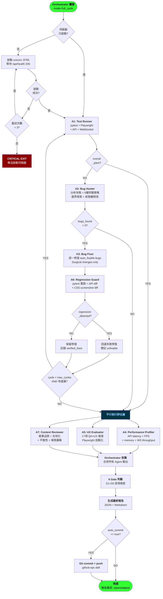
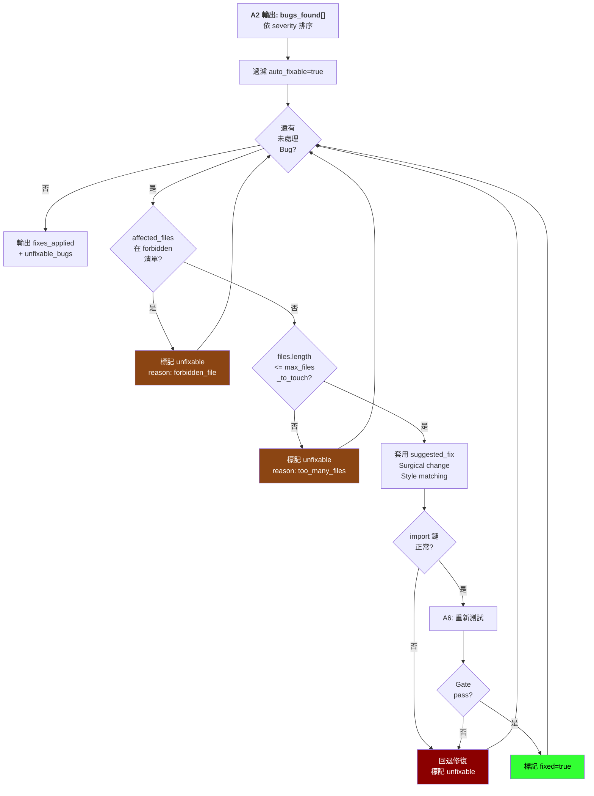
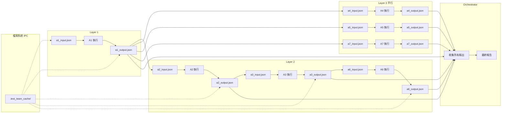
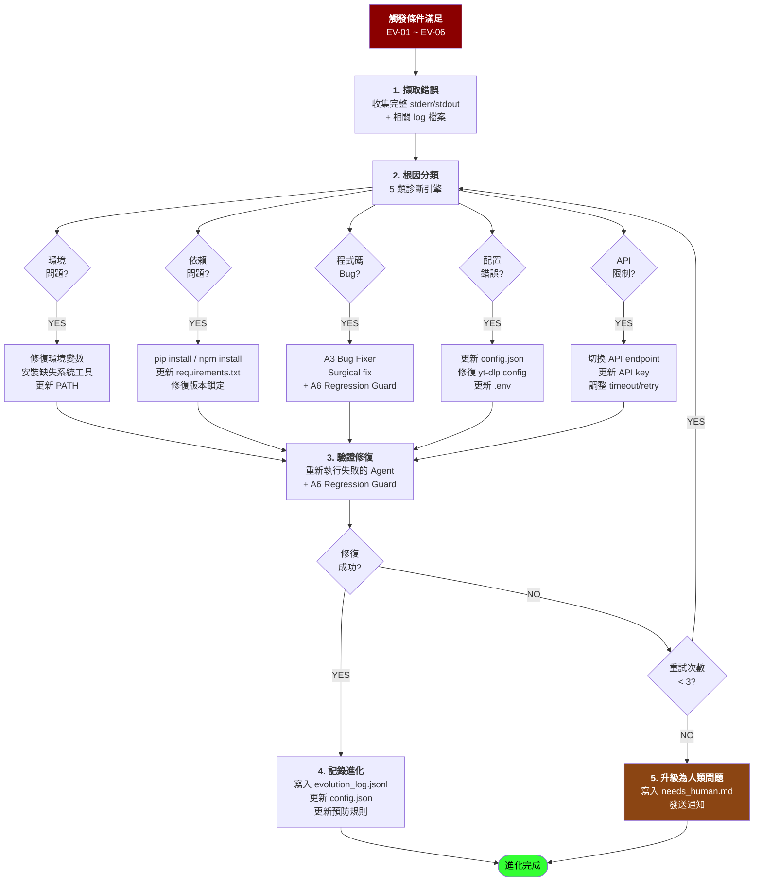

# GAME TEST TEAM PRD — 全自動 Multi-Agent 遊戲測試與強化團隊

> **版本：** 2.0
> **建立日期：** 2026-04-29
> **目標遊戲：** 千禧年蟲事件 (Millennium Bug Incident) — Y2K Liminal Space Web Game
> **遊戲目錄：** `C:\Users\qwqwh\.claude\projects\multi-agent-plan\output\`
> **PRD 作者：** Claude Code (Game Test Team Architect)

---

## 1. 概述與目標

### 1.1 一句話目的

建立一個 8-Agent 全自動遊戲測試團隊，能自主啟動遊戲伺服器、載入前端、執行 pytest + Playwright + API + WebSocket 測試、發現 Bug、自動修復、驗證修復、評估 UX 品質，並將結果推送到 GitHub，全程零人工干預。

### 1.2 核心目標

| # | 目標 | 衡量方式 |
|---|------|----------|
| G1 | 自動化測試循環 | 每 30 分鐘觸發一次完整測試→修復→驗證循環，或由 git push 觸發 |
| G2 | Bug 發現率 > 90% | 比較手動測試發現的 Bug vs 自動發現的 Bug |
| G3 | 自動修復率 > 70% | 無需人工介入即可修復的 Bug 比例 |
| G4 | 修復不回退 | 修復後 pytest 29/29 必須保持全綠，所有 QA 檢查必須通過 |
| G5 | Y2K 設計規則 100% 合規 | 17 項 QA+UX 檢查全部通過 |
| G6 | 自我進化 | 每次失敗後診斷根因 → 搜尋修復方案 → 更新配置 → 記錄進化 |

### 1.3 硬性約束

| # | 約束 | 說明 |
|---|------|------|
| C1 | 嚴禁雲端語音/視覺 API | 所有測試在本機執行，不依賴外部付費 API |
| C2 | 不修改遊戲核心規則 | 僅修復 Bug 和強化非核心系統，禁止修改 StoryEngine、GameState 核心邏輯 |
| C3 | 所有變更必須可追溯 | Git commit + JSONL devlog + 測試報告存檔 |
| C4 | 前端必須在真實瀏覽器中測試 | Playwright Chromium headless，非 mock DOM |
| C5 | 後端必須啟動真實伺服器 | uvicorn 實際監聽 port 8765（獨立測試 port） |
| C6 | Caveman 編碼風格 | 所有 Agent 生成的程式碼必須精簡、無多餘抽象 |
| C7 | 檔案系統 IPC | Agent 間通訊僅使用 JSON 檔案，無網路/IPC 依賴 |

---

## 2. Agent 團隊設計

### 2.0 團隊總覽

```
                    ┌──────────────────────────────┐
                    │     A0: Team Orchestrator      │
                    │   (任務分配 / 循環控制 / 報告)    │
                    └──┬───┬───┬───┬───┬───┬───┬────┘
                       │   │   │   │   │   │   │
          ┌────────────┼───┼───┼───┼───┼───┼───┼────────┐
          │            │   │   │   │   │   │   │        │
          ▼            ▼   ▼   ▼   ▼   ▼   ▼   ▼        ▼
     ┌──────┐  ┌──────┐┌──────┐┌──────┐┌──────┐┌──────┐┌──────┐
     │  A1  │  │  A2  ││  A3  ││  A4  ││  A5  ││  A6  ││  A7  │
     │ Test │  │ Bug  ││ Bug  ││ Perf ││  UX  ││Regr  ││Content│
     │Runner│  │Hunter││Fixer ││Prof  ││Eval  ││Guard ││Review│
     └──────┘  └──────┘└──────┘└──────┘└──────┘└──────┘└──────┘
      Layer 1   Layer 2  Layer 2  Layer 3  Layer 3  Layer 2  Layer 3
```

**分層說明：**
- **Layer 1** — 入口層：測試執行，所有循環的起點
- **Layer 2** — 修復層：Bug 發現→修復→驗證，形成內部循環
- **Layer 3** — 評估層：平行執行，不阻塞修復流程

---

### 2.1 A0: Team Orchestrator（團隊協調者）

#### 角色定義

管理整個測試團隊的生命週期：觸發時機判斷、任務優先級排序、Agent 執行順序控制、循環終止條件判斷、最終報告生成、Git push 決策。

#### 指派的技能

| 技能 | 用途 |
|------|------|
| `gstack-guard` | 品質門檻判斷，決定是否允許進入下一階段 |
| `gstack-ship` | 最終報告生成，決定是否自動 push |
| `ccgs-qa-plan` | QA 計畫制定，決定測試範圍與優先級 |
| `caveman` | 精簡輸出格式，減少 token 消耗 |
| `github-ops` | Git commit + push（在 auto_commit 模式） |

#### 依賴關係

```
A0 不依賴任何 Agent（它是起點）
所有 Agent 依賴 A0 的調度決策
A0 讀取所有 Agent 輸出後做最終判斷
```

#### 核心邏輯（偽代碼）

```
orchestrate(mode, max_cycles, auto_commit):
  cycle = 0
  while cycle < max_cycles:
    cycle += 1
    results = {}

    // Step 1: 啟動遊戲伺服器
    server = start_game_server(port=8765)

    // Step 2: 執行 A1（必要入口）
    results.a1 = run_agent("A1", test_scope="all")

    // Step 3: 判斷是否需要修復
    if not results.a1.overall_pass:
      results.a2 = run_agent("A2", hunt_depth="standard")
      if results.a2.bugs_found:
        results.a3 = run_agent("A3", bugs=results.a2.bugs_found)
        results.a6 = run_agent("A6", fix_output=results.a3)
        if results.a6.regression_detected:
          continue  // 回退修復，下一輪重試

    // Step 4: 平行執行評估層
    results.a4 = run_agent_parallel("A4")
    results.a5 = run_agent_parallel("A5")
    results.a7 = run_agent_parallel("A7")

    // Step 5: 判斷退出條件
    if all_gates_green(results) and bugs_remaining == 0:
      break

  // Step 6: 生成最終報告
  report = generate_report(results, cycles=cycle)
  stop_game_server()

  // Step 7: 自動 commit（如啟用）
  if auto_commit and report.status != "critical_issues":
    git_commit_and_push(report)

  return report
```

#### 輸入 JSON Schema

```json
{
  "$schema": "http://json-schema.org/draft-07/schema#",
  "type": "object",
  "required": ["orchestration_id"],
  "properties": {
    "orchestration_id": {
      "type": "string",
      "description": "唯一協調 ID，用於關聯所有 Agent 輸出"
    },
    "mode": {
      "type": "string",
      "enum": ["full_cycle", "quick_check", "fix_only", "review_only"],
      "default": "full_cycle",
      "description": "full_cycle=全部測試+修復+評估 / quick_check=僅A1 / fix_only=A1+A2+A3+A6循環 / review_only=A4+A5+A7"
    },
    "max_cycles": {
      "type": "integer",
      "default": 5,
      "minimum": 1,
      "maximum": 10,
      "description": "最大修復循環次數，防止無限循環"
    },
    "target_url": {
      "type": "string",
      "default": "http://localhost:8765",
      "description": "遊戲伺服器 URL"
    },
    "auto_commit": {
      "type": "boolean",
      "default": false,
      "description": "是否自動 git commit + push 修復結果"
    },
    "focus_bugs": {
      "type": "array",
      "items": { "type": "string" },
      "description": "指定要修復的 bug_id 清單（空=全部）"
    },
    "skip_agents": {
      "type": "array",
      "items": { "type": "string", "enum": ["A2", "A3", "A4", "A5", "A6", "A7"] },
      "description": "跳過特定 Agent"
    },
    "game_source_dir": {
      "type": "string",
      "default": "C:\\Users\\qwqwh\\.claude\\projects\\multi-agent-plan\\output",
      "description": "遊戲源碼根目錄"
    }
  }
}
```

#### 輸出 JSON Schema

```json
{
  "$schema": "http://json-schema.org/draft-07/schema#",
  "type": "object",
  "required": ["orchestration_id", "status", "cycle_results", "final_report_path"],
  "properties": {
    "orchestration_id": { "type": "string" },
    "status": {
      "type": "string",
      "enum": ["all_clear", "bugs_fixed", "bugs_remain", "critical_issues"],
      "description": "all_clear=零Bug / bugs_fixed=全部修復 / bugs_remain=有未修復Bug / critical_issues=緊急退出"
    },
    "cycles_completed": { "type": "integer" },
    "started_at": { "type": "string", "format": "date-time" },
    "completed_at": { "type": "string", "format": "date-time" },
    "total_duration_seconds": { "type": "number" },
    "summary": {
      "type": "object",
      "required": ["tests_passed", "bugs_found", "bugs_fixed", "bugs_remaining", "qa_checks_passed"],
      "properties": {
        "tests_passed": { "type": "integer" },
        "tests_total": { "type": "integer" },
        "bugs_found": { "type": "integer" },
        "bugs_fixed": { "type": "integer" },
        "bugs_remaining": { "type": "integer" },
        "bugs_unfixable": { "type": "integer" },
        "qa_checks_passed": { "type": "integer" },
        "qa_checks_total": { "type": "integer" },
        "performance_health": { "type": "string", "enum": ["good", "warning", "critical"] },
        "content_score": { "type": "number", "minimum": 0, "maximum": 100 },
        "files_changed": { "type": "integer" },
        "regressions_caught": { "type": "integer" }
      }
    },
    "cycle_results": {
      "type": "array",
      "items": {
        "type": "object",
        "required": ["cycle_number", "agents_triggered"],
        "properties": {
          "cycle_number": { "type": "integer" },
          "agents_triggered": {
            "type": "array",
            "items": { "type": "string" }
          },
          "bugs_fixed_this_cycle": { "type": "integer" },
          "regression_detected": { "type": "boolean" },
          "duration_seconds": { "type": "number" },
          "gates_status": {
            "type": "object",
            "properties": {
              "G1_test_baseline": { "type": "boolean" },
              "G2_api_integrity": { "type": "boolean" },
              "G3_css_compliance": { "type": "boolean" },
              "G4_no_regression": { "type": "boolean" },
              "G5_performance_floor": { "type": "boolean" },
              "G6_fix_forward": { "type": "boolean" }
            }
          }
        }
      }
    },
    "final_report_path": { "type": "string" },
    "git_commit_hash": { "type": "string" },
    "errors": { "type": "array", "items": { "type": "string" } }
  }
}
```

#### 品質門檻（A0 層級）

| Gate | 條件 | 失敗行為 |
|------|------|----------|
| 循環上限 | `cycles_completed <= max_cycles` | 強制退出，輸出最終報告 |
| 進展下限 | 每輪至少修復 1 個 Bug 或這是第一輪 | 退出循環（無進展則不浪費資源） |
| 伺服器健康 | 每輪開始前 ping `/api/health` 必須回 200 | 嘗試重啟伺服器，最多 3 次 |
| 輸出完整性 | 所有被觸發的 Agent 必須產生有效輸出檔案 | 標記該 Agent 為 failed，記錄錯誤 |

---

### 2.2 A1: Test Runner（測試執行者）

#### 角色定義

啟動遊戲伺服器、執行完整測試套件（pytest + Playwright + API + WebSocket）、收集所有測試結果、輸出結構化 JSON 報告。這是整個團隊的入口 Agent，所有後續 Agent 的觸發條件都基於 A1 的輸出。

#### 指派的技能

| 技能 | 用途 |
|------|------|
| `game-tester` | 遊戲測試核心引擎，pytest 執行與結果解析 |
| `game-tester-mini` | 快速 smoke test（僅檢查伺服器啟動 + 首頁載入） |
| `game-tester-simple` | 簡化測試流程，用於單一端點測試 |
| `caveman` | 精簡輸出 |
| `gstack-qa` | QA 整合，測試報告格式化 |

#### 依賴關係

```
A1 依賴:
  - 遊戲伺服器必須已啟動（由 A0 啟動或 A1 自行啟動）
  - backend/test_server.py 存在
  - Playwright 瀏覽器已安裝 (npx playwright install chromium)

A1 被依賴:
  - A2 (Bug Hunter) 讀取 A1 輸出中的失敗測試
  - A0 (Orchestrator) 讀取 A1 輸出判斷是否觸發修復層
  - A6 (Regression Guard) 使用 A1 輸出作為修復前 baseline
```

#### 測試範圍定義

| 套件 | 工具 | 內容 | 預期耗時 |
|------|------|------|----------|
| pytest | `pytest backend/test_server.py -v --tb=short` | 29 個既有測試 | ~30s |
| Playwright | `npx playwright test` | 5 個瀏覽器場景 | ~45s |
| API | curl 腳本 | 4 個 REST endpoints | ~10s |
| WebSocket | wscat/curl | streaming + state_update | ~15s |
| Smoke | curl `/api/health` + `/` | 快速驗證伺服器存活 | ~3s |

#### 遊戲啟動方式（A1 內建）

A1 負責確認遊戲伺服器是否已啟動。若未啟動，A1 會自行啟動：

```bash
# A1 啟動遊戲的命令（Windows Git Bash 環境）
cd "C:/Users/qwqwh/.claude/projects/multi-agent-plan/output"

# 設定環境變數
export ANTHROPIC_API_KEY="$ANTHROPIC_API_KEY"
export ANTHROPIC_BASE_URL="${ANTHROPIC_BASE_URL:-https://api.deepseek.com/anthropic}"
export ANTHROPIC_MODEL="${ANTHROPIC_MODEL:-deepseek-v4-pro}"
export GAME_SOURCE_DIR="C:/Users/qwqwh/.claude/projects/ai-text-adventure"

# 檢查前端檔案完整性（A1 前置檢查）
# 必須確認以下檔案存在：
#   - frontend/index.html
#   - frontend/css/main.css, panels.css, counters.css, crt.css
#   - frontend/js/api.js, renderer.js, app.js, background.js
#   - frontend/js/scenes/rain_underpass.js, snow_bridge.js, fog_highway.js, blizzard_street.js

# 啟動 uvicorn（背景執行，log 寫入暫存檔）
nohup python -m uvicorn backend.server:app \
  --host 0.0.0.0 \
  --port 8765 \
  > /tmp/game_test_server.log 2>&1 &

# 等待伺服器就緒（最多 30 秒）
for i in $(seq 1 30); do
  if curl -s http://localhost:8765/api/health > /dev/null 2>&1; then
    echo "Server ready (port 8765)"
    break
  fi
  sleep 1
done

# 載入前端驗證
curl -s http://localhost:8765/ | grep -q "千禧年蟲事件" && echo "Frontend loaded" || echo "Frontend FAIL"
```

#### 輸入 JSON Schema

```json
{
  "$schema": "http://json-schema.org/draft-07/schema#",
  "type": "object",
  "required": ["test_id", "target"],
  "properties": {
    "test_id": {
      "type": "string",
      "description": "唯一測試 ID，格式：YYYYMMDD-HHMMSS-序號"
    },
    "target": {
      "type": "string",
      "enum": ["all", "pytest", "playwright", "api", "websocket", "smoke"],
      "default": "all"
    },
    "server_port": { "type": "integer", "default": 8765 },
    "server_host": { "type": "string", "default": "127.0.0.1" },
    "timeout_seconds": { "type": "integer", "default": 120 },
    "start_server": {
      "type": "boolean",
      "default": true,
      "description": "是否由 A1 自行啟動伺服器"
    },
    "stop_server_after": {
      "type": "boolean",
      "default": false,
      "description": "測試完成後是否關閉伺服器（A0 控制）"
    },
    "game_source_dir": {
      "type": "string",
      "description": "遊戲源碼目錄路徑"
    },
    "playwright_scenarios": {
      "type": "array",
      "items": { "type": "string" },
      "description": "指定要執行的 Playwright 場景檔名，空=全部"
    },
    "pytest_args": {
      "type": "string",
      "default": "-v --tb=short",
      "description": "傳遞給 pytest 的額外參數"
    },
    "retry_failed": {
      "type": "integer",
      "default": 1,
      "minimum": 0,
      "maximum": 3,
      "description": "失敗測試的重試次數"
    }
  }
}
```

#### 輸出 JSON Schema

```json
{
  "$schema": "http://json-schema.org/draft-07/schema#",
  "type": "object",
  "required": ["test_id", "overall_pass", "suites", "server_log_path"],
  "properties": {
    "test_id": { "type": "string" },
    "overall_pass": {
      "type": "boolean",
      "description": "所有測試套件全部通過才為 true"
    },
    "started_at": { "type": "string", "format": "date-time" },
    "completed_at": { "type": "string", "format": "date-time" },
    "duration_seconds": { "type": "number" },
    "server_startup_ok": { "type": "boolean" },
    "frontend_load_ok": { "type": "boolean" },
    "suites": {
      "type": "object",
      "required": ["pytest", "playwright", "api", "websocket", "smoke"],
      "properties": {
        "smoke": {
          "type": "object",
          "required": ["pass", "health_endpoint", "index_html"],
          "properties": {
            "pass": { "type": "boolean" },
            "health_endpoint": { "type": "boolean" },
            "index_html": { "type": "boolean" },
            "frontend_files_checked": { "type": "integer" },
            "frontend_files_missing": { "type": "array", "items": { "type": "string" } }
          }
        },
        "pytest": {
          "type": "object",
          "required": ["pass", "total", "passed", "failed", "errors"],
          "properties": {
            "pass": { "type": "boolean" },
            "total": { "type": "integer" },
            "passed": { "type": "integer" },
            "failed": { "type": "integer" },
            "errors": { "type": "integer" },
            "duration_seconds": { "type": "number" },
            "failures": {
              "type": "array",
              "items": {
                "type": "object",
                "required": ["test_name", "error_type", "error_message"],
                "properties": {
                  "test_name": { "type": "string" },
                  "error_type": { "type": "string" },
                  "error_message": { "type": "string" },
                  "traceback": { "type": "string" },
                  "likely_root_cause": { "type": "string" }
                }
              }
            }
          }
        },
        "playwright": {
          "type": "object",
          "required": ["pass", "scenarios_total", "scenarios_passed"],
          "properties": {
            "pass": { "type": "boolean" },
            "scenarios_total": { "type": "integer" },
            "scenarios_passed": { "type": "integer" },
            "scenarios_failed": { "type": "integer" },
            "duration_seconds": { "type": "number" },
            "failures": {
              "type": "array",
              "items": {
                "type": "object",
                "required": ["scenario", "step", "error"],
                "properties": {
                  "scenario": { "type": "string" },
                  "step": { "type": "string" },
                  "error": { "type": "string" },
                  "screenshot_path": { "type": "string" }
                }
              }
            }
          }
        },
        "api": {
          "type": "object",
          "required": ["pass", "endpoints_tested", "endpoints_passed"],
          "properties": {
            "pass": { "type": "boolean" },
            "endpoints_tested": { "type": "integer" },
            "endpoints_passed": { "type": "integer" },
            "failures": {
              "type": "array",
              "items": {
                "type": "object",
                "required": ["endpoint", "method", "status_code", "error"],
                "properties": {
                  "endpoint": { "type": "string" },
                  "method": { "type": "string", "enum": ["GET", "POST", "WS"] },
                  "expected_status": { "type": "integer" },
                  "actual_status": { "type": "integer" },
                  "response_body": { "type": "string" },
                  "error": { "type": "string" }
                }
              }
            }
          }
        },
        "websocket": {
          "type": "object",
          "required": ["pass", "connection_ok", "streaming_ok", "state_update_ok"],
          "properties": {
            "pass": { "type": "boolean" },
            "connection_ok": { "type": "boolean" },
            "streaming_ok": { "type": "boolean" },
            "state_update_ok": { "type": "boolean" },
            "tokens_received": { "type": "integer" },
            "errors": { "type": "array", "items": { "type": "string" } }
          }
        }
      }
    },
    "server_log_path": {
      "type": "string",
      "description": "uvicorn 伺服器 log 檔案路徑"
    },
    "errors": {
      "type": "array",
      "items": { "type": "string" },
      "description": "A1 本身的執行錯誤（非測試失敗）"
    }
  }
}
```

#### 品質門檻（A1 層級）

| Gate | 條件 | 失敗行為 |
|------|------|----------|
| 伺服器啟動 | `server_startup_ok == true` | 重試 3 次，每次間隔 5 秒；全失敗則標記 critical |
| 前端載入 | `frontend_load_ok == true` | 報告缺失檔案清單，交由 A3 修復 |
| Smoke | `smoke.pass == true` | 中止所有後續測試，報告 Orchestrator |
| pytest 完整性 | `pytest.total == 29` | 若 total < 29，表示測試檔案遺失或被修改 |
| 輸出完整性 | 所有 suite 物件非 null | 標記缺失 suite 為 "skipped"，記錄原因 |

---

### 2.3 A2: Bug Hunter（Bug 獵人）

#### 角色定義

分析 A1 測試失敗、主動探索邊界案例、發現隱藏 Bug、分類每個 Bug 的嚴重性與類別、提供 reproduction steps 與 suggested fix。

#### 指派的技能

| 技能 | 用途 |
|------|------|
| `game-tester` | 進階測試策略：邊界值、狀態機探測 |
| `ccgs-bug-report` | Bug 報告格式化（若有此技能） |
| `gstack-review` | 程式碼審查，發現潛在邏輯錯誤 |
| `ccgs-code-review` | 逐檔案程式碼審查 |
| `caveman` | 精簡輸出 |

#### 依賴關係

```
A2 依賴:
  - A1 輸出 (test_output_path) — 取得失敗測試清單
  - 遊戲伺服器必須在執行中（進行邊界探索）

A2 被依賴:
  - A3 (Bug Fixer) 直接讀取 A2 輸出的 bugs_found
```

#### 5 種狩獵策略

| # | 策略 | 方法 | 目標 Bug 類型 |
|---|------|------|--------------|
| 1 | 失敗分析 | 解析 A1 輸出的每個失敗，提取 error_message → 分類根因 | crash, logic |
| 2 | 邊界探索 | 對所有輸入欄位注入極端值（空字串、10000 字、Unicode、SQL injection、XSS） | security, crash |
| 3 | 狀態機探測 | 快速連續點擊、WebSocket 斷線重連、session 過期後訪問 | logic, race condition |
| 4 | 檔案系統檢查 | 檢查 game_sessions/*.json 是否洩漏、是否有孤兒檔案 | performance, logic |
| 5 | CSS/JS 靜態分析 | 檢查 CSS 屬性合規性、JS console 錯誤、字型載入失敗 | ui, compliance |

#### 輸入 JSON Schema

```json
{
  "$schema": "http://json-schema.org/draft-07/schema#",
  "type": "object",
  "required": ["hunt_id", "test_output_path"],
  "properties": {
    "hunt_id": { "type": "string" },
    "test_output_path": {
      "type": "string",
      "description": "A1 輸出的 JSON 檔案路徑"
    },
    "hunt_depth": {
      "type": "string",
      "enum": ["quick", "standard", "deep"],
      "default": "standard",
      "description": "quick=僅分析A1失敗 / standard=失敗+邊界 / deep=全部5種策略"
    },
    "focus_areas": {
      "type": "array",
      "items": {
        "type": "string",
        "enum": ["api", "frontend", "websocket", "state", "css", "performance", "security"]
      },
      "description": "指定聚焦的測試領域，空=全部"
    },
    "max_bugs_to_report": {
      "type": "integer",
      "default": 50,
      "description": "防止報告過量 Bug"
    },
    "target_url": { "type": "string", "default": "http://localhost:8765" },
    "game_source_dir": { "type": "string" }
  }
}
```

#### 輸出 JSON Schema

```json
{
  "$schema": "http://json-schema.org/draft-07/schema#",
  "type": "object",
  "required": ["hunt_id", "bugs_found", "hunt_summary"],
  "properties": {
    "hunt_id": { "type": "string" },
    "hunt_depth_used": { "type": "string" },
    "strategies_executed": {
      "type": "array",
      "items": { "type": "string" }
    },
    "bugs_found": {
      "type": "array",
      "items": {
        "type": "object",
        "required": ["bug_id", "severity", "category", "description", "reproduction_steps", "auto_fixable"],
        "properties": {
          "bug_id": {
            "type": "string",
            "description": "格式：BUG-YYYYMMDD-NNN"
          },
          "severity": {
            "type": "string",
            "enum": ["critical", "high", "medium", "low", "cosmetic"],
            "description": "critical=伺服器crash / high=核心功能損壞 / medium=部分功能異常 / low=邊緣案例 / cosmetic=視覺瑕疵"
          },
          "category": {
            "type": "string",
            "enum": ["crash", "logic", "ui", "performance", "security", "compliance", "localization", "race_condition", "memory_leak"]
          },
          "description": {
            "type": "string",
            "description": "人類可讀的 Bug 描述，一句話"
          },
          "reproduction_steps": {
            "type": "string",
            "description": "可執行的 reproduction 步驟，每行一步"
          },
          "affected_files": {
            "type": "array",
            "items": { "type": "string" },
            "description": "受影響的檔案路徑（相對於 game_source_dir）"
          },
          "evidence_paths": {
            "type": "array",
            "items": { "type": "string" },
            "description": "截圖、log、curl 輸出等證據檔案路徑"
          },
          "suggested_fix": {
            "type": "string",
            "description": "建議的修復方案（一行描述）"
          },
          "auto_fixable": {
            "type": "boolean",
            "description": "A3 是否可以自動修復此 Bug"
          },
          "auto_fixable_reason": {
            "type": "string",
            "description": "若 auto_fixable=false，說明原因"
          },
          "source": {
            "type": "string",
            "enum": ["test_failure", "edge_exploration", "static_analysis", "state_probe", "file_check"]
          }
        }
      }
    },
    "edge_cases_tested": { "type": "integer" },
    "hunt_summary": {
      "type": "object",
      "required": ["total_bugs", "by_severity", "by_category", "auto_fixable_count"],
      "properties": {
        "total_bugs": { "type": "integer" },
        "new_bugs": { "type": "integer", "description": "非 A1 已知失敗的新發現 Bug" },
        "by_severity": {
          "type": "object",
          "properties": {
            "critical": { "type": "integer" },
            "high": { "type": "integer" },
            "medium": { "type": "integer" },
            "low": { "type": "integer" },
            "cosmetic": { "type": "integer" }
          }
        },
        "by_category": { "type": "object" },
        "auto_fixable_count": { "type": "integer" }
      }
    }
  }
}
```

#### 品質門檻（A2 層級）

| Gate | 條件 | 失敗行為 |
|------|------|----------|
| 輸出結構 | `bugs_found` 為有效 array（可為空） | 標記 A2 為 error |
| Bug ID 唯一性 | 所有 `bug_id` 不重複 | 自動去重 |
| Severity 合理性 | 每個 Bug 的 severity 在 enum 範圍內 | 標記 unknown，預設 medium |
| Reproduction | 每個 medium+ Bug 必須有 `reproduction_steps` | 標記為 incomplete |
| 證據完整性 | critical/high Bug 必須有 `evidence_paths` | 標記為 needs_evidence |

---

### 2.4 A3: Bug Fixer（Bug 修復者）

#### 角色定義

讀取 A2 的 Bug 清單，自動修復標記為 `auto_fixable=true` 的 Bug。遵循現有程式碼風格，使用 surgical changes。只修改必要程式碼，不引入新抽象。

#### 指派的技能

| 技能 | 用途 |
|------|------|
| `caveman` | 精簡編碼風格，最少程式碼修復 |
| `caveman-review` | 修復後自我審查 |
| `gstack-review` | 程式碼品質檢查 |
| `ccgs-code-review` | 逐行審查修復內容 |

#### 依賴關係

```
A3 依賴:
  - A2 輸出 (bugs JSON) — 取得待修復 Bug 清單及 suggested_fix
  - 遊戲源碼目錄（讀取 + 寫入權限）

A3 被依賴:
  - A6 (Regression Guard) 必須在 A3 完成後立即執行
```

#### 修復規則（強制）

1. **Surgical Changes** — 只修改必要的行，不做任何多餘重構
2. **Style Matching** — 嚴格遵循既有程式碼風格（縮排、命名、引號、註解格式）
3. **Import Safety** — 修復後檢查 import 鏈，確保無循環依賴、無 import 錯誤
4. **Caveman 編碼** — 精簡程式碼，不新增 helper function、不引入新檔案（除非絕對必要）
5. **Preserve Game Rules** — 嚴禁修改 `game_engine.py` 中的遊戲核心邏輯、`StoryEngine` 的任何行為
6. **Backend-only Fix** — 修復後端 Python 檔案時，必須確保 pytest 仍可 import
7. **Frontend-only Fix** — 修復前端 JS/CSS 時，必須確保無 `import`/`require` 語句、無 `border-radius`
8. **Single Bug Per Fix** — 一次只修一個 Bug，不可在一次修復中混合多個變更

#### 修復前備份機制（不依賴 Git）

Git 歷史可能不完整（agent 輸出覆蓋後未 commit），因此**每個檔案修改前必須先備份到檔案系統**：

```
A3 修復前強制步驟（每個 affected_file 執行一次）：

1. BACKUP_DIR = .test_team_cache/backups/{fix_id}/
2. mkdir -p {BACKUP_DIR}
3. cp {original_file} {BACKUP_DIR}/{basename}.bak
4. 記錄備份路徑到 fixes_applied[].backup_path
```

回退時（由 A6 觸發或 A3 自行觸發）：

```
1. 讀取 fixes_applied[].backup_path
2. cp {backup_path} {original_file}  (從備份恢復原檔案)
3. 寫入 revert_log: {bug_id} reverted from {backup_path}
4. 標記該修復為 reverted=true
```

此機制**與 Git 無關**——即使 Git 歷史被破壞或未 commit，備份仍然有效。備份目錄在整體測試循環結束後由 A0 清理（保留最近 3 次循環的備份）。

#### 輸入 JSON Schema

```json
{
  "$schema": "http://json-schema.org/draft-07/schema#",
  "type": "object",
  "required": ["fix_id", "bugs"],
  "properties": {
    "fix_id": { "type": "string" },
    "bugs": {
      "type": "array",
      "items": {
        "type": "object",
        "required": ["bug_id", "severity", "auto_fixable"],
        "properties": {
          "bug_id": { "type": "string" },
          "severity": { "type": "string" },
          "category": { "type": "string" },
          "affected_files": {
            "type": "array",
            "items": { "type": "string" }
          },
          "description": { "type": "string" },
          "suggested_fix": { "type": "string" },
          "auto_fixable": { "type": "boolean" }
        }
      }
    },
    "game_source_dir": { "type": "string" },
    "max_files_to_touch_per_bug": {
      "type": "integer",
      "default": 3,
      "description": "每個 Bug 最多修改的檔案數，超過則標記 unfixable"
    },
    "dry_run": {
      "type": "boolean",
      "default": false,
      "description": "true=僅輸出修復計畫，不實際寫入檔案"
    },
    "forbidden_files": {
      "type": "array",
      "items": { "type": "string" },
      "default": ["engine/story_engine.py", "game/game_state.py"],
      "description": "禁止修改的檔案清單"
    }
  }
}
```

#### 輸出 JSON Schema

```json
{
  "$schema": "http://json-schema.org/draft-07/schema#",
  "type": "object",
  "required": ["fix_id", "fixes_applied", "unfixable_bugs", "total_fixed", "total_unfixable"],
  "properties": {
    "fix_id": { "type": "string" },
    "fixes_applied": {
      "type": "array",
      "items": {
        "type": "object",
        "required": ["bug_id", "fixed", "files_changed"],
        "properties": {
          "bug_id": { "type": "string" },
          "fixed": { "type": "boolean" },
          "fix_description": { "type": "string", "description": "實際執行的修復內容（一句話）" },
          "files_changed": {
            "type": "array",
            "items": {
              "type": "object",
              "required": ["file", "lines_added", "lines_removed"],
              "properties": {
                "file": { "type": "string" },
                "lines_added": { "type": "integer" },
                "lines_removed": { "type": "integer" },
                "patch_hunk": { "type": "string", "description": "簡短 diff 摘要" },
                "backup_path": { "type": "string", "description": "修復前原始檔案的備份路徑 (.test_team_cache/backups/{fix_id}/{basename}.bak)" }
              }
            }
          },
          "import_chain_checked": { "type": "boolean" },
          "style_matched": { "type": "boolean" },
          "forbidden_files_touched": { "type": "boolean" },
          "reverted": { "type": "boolean", "default": false, "description": "此修復是否已被 A6 或 A3 自行回退" }
        }
      }
    },
    "unfixable_bugs": {
      "type": "array",
      "items": {
        "type": "object",
        "required": ["bug_id", "reason", "needs_human"],
        "properties": {
          "bug_id": { "type": "string" },
          "reason": {
            "type": "string",
            "enum": [
              "forbidden_file",
              "too_many_files",
              "core_game_logic",
              "requires_new_dependency",
              "ambiguous_root_cause",
              "fix_introduces_breaking_change",
              "requires_design_decision",
              "cannot_reproduce"
            ]
          },
          "needs_human": { "type": "boolean" },
          "human_guidance_needed": { "type": "string", "description": "人類需要提供什麼資訊" }
        }
      }
    },
    "total_fixed": { "type": "integer" },
    "total_unfixable": { "type": "integer" },
    "total_skipped": { "type": "integer", "description": "auto_fixable=false 跳過的 Bug 數" },
    "errors": { "type": "array", "items": { "type": "string" } }
  }
}
```

#### 品質門檻（A3 層級）

| Gate | 條件 | 失敗行為 |
|------|------|----------|
| 禁止檔案 | `forbidden_files_touched == false` (所有修復) | 回退該修復，標記 unfixable |
| Import 安全 | `import_chain_checked == true` (所有修復) | 回退該修復 |
| 風格匹配 | `style_matched == true` (所有修復) | 記錄 warning，不阻止 |
| 檔案數量 | 每個 Bug `files_changed.length <= max_files_to_touch_per_bug` | 標記 unfixable |
| 空修復 | `total_fixed + total_unfixable > 0` | 若為 0，表示 A3 未執行任何操作 |

---

### 2.5 A4: Performance Profiler（性能分析師）

#### 角色定義

測量遊戲各層性能指標，發現瓶頸，輸出可量化的性能報告。不修改任何程式碼。

#### 指派的技能

| 技能 | 用途 |
|------|------|
| `ccgs-architecture-review` | 架構層級性能瓶頸分析 |
| `gstack-review` | 程式碼性能審查 |
| `caveman` | 精簡輸出 |

#### 依賴關係

```
A4 依賴:
  - 遊戲伺服器必須在執行中（進行 API latency 測試）
  - A1 輸出（取得既有測試結果作為 baseline）

A4 被依賴:
  - A0 讀取 A4 輸出，寫入最終報告的性能章節
```

#### 測量指標

| 指標 | 測量方式 | 目標值 | 警告值 | 危險值 |
|------|----------|--------|--------|--------|
| API Health p50 | `curl -w "%{time_total}" /api/health` × 100次 | < 10ms | 10-50ms | > 50ms |
| API Action p95 | POST `/api/game/action` × 20次 | < 5000ms | 5-10s | > 10s |
| API State p50 | GET `/api/game/state` × 100次 | < 20ms | 20-100ms | > 100ms |
| API New p50 | POST `/api/game/new` × 20次 | < 500ms | 0.5-2s | > 2s |
| WebSocket Token Interval | 計算每個 token 的平均間隔 | < 100ms | 100-300ms | > 300ms |
| WebSocket Connect Time | 建立連線到收到第一個 token | < 2s | 2-5s | > 5s |
| Frontend FPS (avg) | Playwright `page.evaluate` 測量 requestAnimationFrame | > 30 | 15-30 | < 15 |
| Frontend FPS (min) | 場景切換時的瞬時最低 FPS | > 15 | 8-15 | < 8 |
| Scene Switch Latency | 從 scene_trigger 發送到 switchScene 完成 | < 4s | 4-8s | > 8s |
| Python Memory (MB) | `psutil.Process.memory_info().rss` | < 200MB | 200-500MB | > 500MB |
| Session File Size (KB) | `game_sessions/*.json` 平均大小 | < 50KB | 50-200KB | > 200KB |
| Session File Count | `game_sessions/` 中的 JSON 檔案數 | < 100 | 100-500 | > 500 |

#### 輸入 JSON Schema

```json
{
  "$schema": "http://json-schema.org/draft-07/schema#",
  "type": "object",
  "required": ["profile_id"],
  "properties": {
    "profile_id": { "type": "string" },
    "target_url": { "type": "string", "default": "http://localhost:8765" },
    "duration_seconds": { "type": "integer", "default": 60, "description": "性能取樣持續時間" },
    "concurrent_users": { "type": "integer", "default": 1, "minimum": 1, "maximum": 10 },
    "sample_rate": {
      "type": "integer",
      "default": 10,
      "description": "API latency 取樣次數（每個 endpoint）"
    },
    "profile_scenes": {
      "type": "array",
      "items": { "type": "string", "enum": ["rain_underpass", "snow_bridge", "fog_highway", "blizzard_street"] },
      "default": ["fog_highway", "rain_underpass"],
      "description": "要測量 FPS 的場景"
    },
    "game_source_dir": { "type": "string" }
  }
}
```

#### 輸出 JSON Schema

```json
{
  "$schema": "http://json-schema.org/draft-07/schema#",
  "type": "object",
  "required": ["profile_id", "overall_health", "metrics", "bottlenecks"],
  "properties": {
    "profile_id": { "type": "string" },
    "overall_health": {
      "type": "string",
      "enum": ["good", "warning", "critical"],
      "description": "good=所有指標在目標範圍 / warning=1+指標在警告範圍 / critical=1+指標在危險範圍"
    },
    "sampled_at": { "type": "string", "format": "date-time" },
    "duration_seconds": { "type": "number" },
    "metrics": {
      "type": "object",
      "required": ["api_latency", "websocket", "frontend", "memory"],
      "properties": {
        "api_latency": {
          "type": "object",
          "required": ["health_p50_ms", "action_p95_ms", "state_p50_ms", "new_p50_ms"],
          "properties": {
            "health_p50_ms": { "type": "number" },
            "health_p95_ms": { "type": "number" },
            "health_p99_ms": { "type": "number" },
            "action_p50_ms": { "type": "number" },
            "action_p95_ms": { "type": "number" },
            "action_p99_ms": { "type": "number" },
            "state_p50_ms": { "type": "number" },
            "new_p50_ms": { "type": "number" }
          }
        },
        "websocket": {
          "type": "object",
          "required": ["avg_token_interval_ms", "connection_time_ms"],
          "properties": {
            "avg_token_interval_ms": { "type": "number" },
            "p95_token_interval_ms": { "type": "number" },
            "connection_time_ms": { "type": "number" },
            "tokens_per_second": { "type": "number" }
          }
        },
        "frontend": {
          "type": "object",
          "required": ["avg_fps", "min_fps"],
          "properties": {
            "avg_fps": { "type": "number" },
            "min_fps": { "type": "number" },
            "scene_fps": {
              "type": "object",
              "description": "每個場景的 avg_fps",
              "additionalProperties": { "type": "number" }
            },
            "scene_switch_latency_ms": { "type": "number" }
          }
        },
        "memory": {
          "type": "object",
          "required": ["python_memory_mb", "session_files_count", "total_session_size_kb"],
          "properties": {
            "python_memory_mb": { "type": "number" },
            "session_files_count": { "type": "integer" },
            "total_session_size_kb": { "type": "number" },
            "avg_session_size_kb": { "type": "number" }
          }
        }
      }
    },
    "bottlenecks": {
      "type": "array",
      "items": {
        "type": "object",
        "required": ["component", "severity", "metric", "current_value", "threshold", "suggestion"],
        "properties": {
          "component": { "type": "string" },
          "severity": { "type": "string", "enum": ["critical", "warning"] },
          "metric": { "type": "string" },
          "current_value": { "type": "number" },
          "threshold": { "type": "number" },
          "unit": { "type": "string" },
          "suggestion": { "type": "string" }
        }
      }
    }
  }
}
```

#### 品質門檻（A4 層級）

| Gate | 條件 | 失敗行為 |
|------|------|----------|
| 取樣數 | `sample_rate >= 10` (每個 endpoint) | 降低 sample_rate 會影響 p95/p99 準確度 |
| 場景覆蓋 | 至少測試 2 個場景 | 標記 warning |
| API 可用 | 所有 4 個 endpoint 回應非 error | 標記該 endpoint 為 N/A |

---

### 2.6 A5: UX Evaluator（UX 評估員）

#### 角色定義

使用 Playwright 執行瀏覽器自動化 UX 測試。執行全部 17 項 QA+UX 檢查，輸出逐項 pass/fail + 證據。

#### 指派的技能

| 技能 | 用途 |
|------|------|
| `ccgs-ux-design` | UX 設計指南與評估標準 |
| `ccgs-design-review` | 設計審查，Y2K 規則合規性 |
| `ccgs-art-bible` | 視覺風格指南驗證（若有） |
| `game-tester` | Playwright 瀏覽器自動化 |
| `caveman` | 精簡輸出 |

#### 依賴關係

```
A5 依賴:
  - 遊戲伺服器必須在執行中
  - Playwright 瀏覽器已安裝
  - 前端 assets 目錄存在（字型/紋理缺失會觸發檢查失敗）

A5 被依賴:
  - A0 讀取 A5 輸出，合併到最終 QA 報告
  - A3 可能被觸發修復 UX 問題
```

#### 17 項檢查清單

| ID | 類別 | 檢查項目 | 檢查方式 | 量化標準 |
|----|------|----------|----------|----------|
| Q1 | css | CSS 色盤合規 | 提取所有 hex 顏色，比對 12 色盤 | 100% hex 顏色在色盤內 |
| Q2 | css | 無暖色 | grep `#FF[0-9A-F]`、`orange`、`yellow`、`pink`（排除 #8B0000） | 0 matches |
| Q3 | css | 無 border-radius | grep `border-radius` 所有 CSS | 0 matches |
| Q4 | css | CRT 透明度 | 解析 crt.css `opacity` 值 | 0.35 ≤ opacity ≤ 0.45 |
| Q5 | html | 無框架 import | grep `react\|vue\|angular\|jquery\|bootstrap` | 0 matches |
| Q6 | html | 無 emoji | Unicode emoji range scan | 0 matches |
| Q7 | html | 完整 DOM 結構 | 檢查所有 8 個必要容器 ID 存在 | 8/8 存在 |
| Q8 | js | 無 import/require | grep `import \|require(` 所有 JS | 0 matches |
| Q9 | js | 無框架引用 | grep `react\|vue\|angular\|jQuery\|$(` 所有 JS | 0 matches |
| Q10 | js | 無 console.error | Playwright 擷取瀏覽器 console | 0 errors |
| Q11 | js | PS1 vertex wobble | 檢查 GLSL shader 中 `sin(.*uTimeWobble)` | 必須存在 |
| Q12 | backend | API schema valid | 所有 endpoint 回應包含 5 個必要欄位 | 5/5 欄位存在 |
| Q13 | backend | pytest 29/29 | 執行 pytest | 29 passed, 0 failed |
| Q14 | ux | 打字機速度 | Playwright 量測字元間隔 | 30ms ≤ 間隔 ≤ 50ms |
| Q15 | ux | Viewer counter glitch | Playwright 觀察 counter 變更時的 CSS class | `glitching` class 出現 |
| Q16 | ux | 場景轉換 | Playwright 觸發 scene_trigger，量測 crossfade | 3s ± 0.5s，CRT noise 出現 |
| Q17 | ux | 輸入鎖定 | Playwright 快速雙擊發送按鈕 | 第二次點擊無效（processing=true 阻擋） |

#### 輸入 JSON Schema

```json
{
  "$schema": "http://json-schema.org/draft-07/schema#",
  "type": "object",
  "required": ["eval_id"],
  "properties": {
    "eval_id": { "type": "string" },
    "target_url": { "type": "string", "default": "http://localhost:8765" },
    "checks_to_run": {
      "type": "array",
      "items": { "type": "string", "enum": ["Q1","Q2","Q3","Q4","Q5","Q6","Q7","Q8","Q9","Q10","Q11","Q12","Q13","Q14","Q15","Q16","Q17"] },
      "default": ["Q1","Q2","Q3","Q4","Q5","Q6","Q7","Q8","Q9","Q10","Q11","Q12","Q13","Q14","Q15","Q16","Q17"]
    },
    "browser": { "type": "string", "default": "chromium", "enum": ["chromium", "firefox", "webkit"] },
    "headless": { "type": "boolean", "default": true },
    "screenshot_on_failure": { "type": "boolean", "default": true },
    "viewport_width": { "type": "integer", "default": 1280 },
    "viewport_height": { "type": "integer", "default": 720 },
    "game_source_dir": { "type": "string" }
  }
}
```

#### 輸出 JSON Schema

```json
{
  "$schema": "http://json-schema.org/draft-07/schema#",
  "type": "object",
  "required": ["eval_id", "overall_pass", "checks"],
  "properties": {
    "eval_id": { "type": "string" },
    "overall_pass": { "type": "boolean", "description": "所有被執行的檢查全部通過才為 true" },
    "total_checks": { "type": "integer" },
    "passed_checks": { "type": "integer" },
    "failed_checks": { "type": "integer" },
    "skipped_checks": { "type": "integer" },
    "checks": {
      "type": "array",
      "items": {
        "type": "object",
        "required": ["id", "name", "pass", "evidence", "category"],
        "properties": {
          "id": { "type": "string" },
          "name": { "type": "string" },
          "pass": { "type": "boolean" },
          "evidence": { "type": "string", "description": "機器可讀的證據（grep output、Playwright 擷取值、screenshot 路徑）" },
          "category": { "type": "string", "enum": ["css", "html", "js", "backend", "ux"] },
          "actual_value": { "type": "string", "description": "實際測量值（用於數值比較的檢查）" },
          "expected_value": { "type": "string" },
          "screenshot_path": { "type": "string" }
        }
      }
    },
    "ux_issues": {
      "type": "array",
      "items": {
        "type": "object",
        "required": ["issue", "severity", "check_id"],
        "properties": {
          "issue": { "type": "string" },
          "severity": { "type": "string" },
          "check_id": { "type": "string" },
          "fix_suggestion": { "type": "string" }
        }
      }
    },
    "browser_console_errors": {
      "type": "array",
      "items": { "type": "string" }
    }
  }
}
```

#### 品質門檻（A5 層級）

| Gate | 條件 | 失敗行為 |
|------|------|----------|
| 必要檢查 | Q1-Q13 必須全部執行 | 缺失任何一項 → overall_pass = false |
| 證據完整性 | 每個 failed check 必須有 `evidence` | 標記為 incomplete |
| Screenshot | 每個 failed check 應有 `screenshot_path` | 記錄 warning |

---

### 2.7 A6: Regression Guard（回歸防衛者）

#### 角色定義

在 A3 修復完成後重新執行完整測試，比較修復前後的測試結果、API 回應、CSS 渲染截圖。任何回歸立即阻止合併，並回報具體差異。

#### 指派的技能

| 技能 | 用途 |
|------|------|
| `gstack-guard` | 品質門檻判斷，gate check |
| `gstack-qa` | QA 回歸測試執行 |
| `game-tester` | pytest 重新執行 |
| `caveman` | 精簡輸出 |

#### 依賴關係

```
A6 依賴:
  - A1 輸出 (pre_fix_snapshot) — 修復前的測試結果
  - A3 輸出 (fixes_applied) — 修復內容
  - 遊戲伺服器必須在執行中（重新測試）
  - 修復後的源碼

A6 被依賴:
  - A0 讀取 A6 輸出，判斷是否需要回退修復
  - A3 可能被重新觸發（修復回退後）
```

#### 防衛程序（5 步）

```
Step 1: Pre-Fix Snapshot 載入
  → 讀取 A1 輸出作為 baseline

Step 2: Post-Fix 測試
  → 重新執行 pytest（必須 29/29）
  → 重新執行 API 測試（所有 endpoint）
  → 重新執行 WebSocket 測試

Step 3: API Response Diff
  → 比較修復前後的 API 回應結構
  → 檢查：無欄位消失、無型別變更、無 status code 變更

Step 4: CSS Screenshot Diff
  → 使用 Playwright 擷取修復前後的 full-page screenshot
  → pixel-diff 比較（容忍度 < 2%）

Step 5: Gate Decision
  → 任一失敗 → gate_pass = false → 通知 A0 回退
  → 全部通過 → gate_pass = true → 允許保留修復
```

#### 輸入 JSON Schema

```json
{
  "$schema": "http://json-schema.org/draft-07/schema#",
  "type": "object",
  "required": ["guard_id", "fix_output_path", "pre_fix_test_output_path"],
  "properties": {
    "guard_id": { "type": "string" },
    "fix_output_path": {
      "type": "string",
      "description": "A3 輸出 JSON 路徑"
    },
    "pre_fix_test_output_path": {
      "type": "string",
      "description": "A1 輸出 JSON 路徑（修復前 baseline）"
    },
    "changed_files": {
      "type": "array",
      "items": { "type": "string" },
      "description": "A3 修改的檔案清單"
    },
    "target_url": { "type": "string", "default": "http://localhost:8765" },
    "screenshot_diff_tolerance_pct": {
      "type": "number",
      "default": 2.0,
      "description": "像素差異容忍百分比"
    },
    "game_source_dir": { "type": "string" }
  }
}
```

#### 輸出 JSON Schema

```json
{
  "$schema": "http://json-schema.org/draft-07/schema#",
  "type": "object",
  "required": ["guard_id", "regression_detected", "gate_pass"],
  "properties": {
    "guard_id": { "type": "string" },
    "regression_detected": { "type": "boolean" },
    "gate_pass": { "type": "boolean", "description": "所有 gate 通過才為 true" },
    "pytest_rerun": {
      "type": "object",
      "required": ["current_pass_count", "new_failures"],
      "properties": {
        "previous_pass_count": { "type": "integer" },
        "previous_fail_count": { "type": "integer" },
        "current_pass_count": { "type": "integer" },
        "current_fail_count": { "type": "integer" },
        "new_failures": {
          "type": "array",
          "items": {
            "type": "object",
            "required": ["test_name", "error_message"],
            "properties": {
              "test_name": { "type": "string" },
              "error_message": { "type": "string" },
              "caused_by_fix": { "type": "boolean" },
              "related_bug_id": { "type": "string" }
            }
          }
        },
        "resolved_failures": {
          "type": "array",
          "items": { "type": "string" },
          "description": "修復後消失的失敗測試名稱"
        }
      }
    },
    "api_diff": {
      "type": "object",
      "required": ["breaking_changes", "non_breaking_changes"],
      "properties": {
        "breaking_changes": {
          "type": "array",
          "items": {
            "type": "object",
            "required": ["endpoint", "change_type", "detail"],
            "properties": {
              "endpoint": { "type": "string" },
              "change_type": {
                "type": "string",
                "enum": ["field_removed", "field_type_changed", "status_code_changed", "response_structure_changed"]
              },
              "detail": { "type": "string" }
            }
          }
        },
        "non_breaking_changes": {
          "type": "array",
          "items": { "type": "string" }
        },
        "unchanged": { "type": "boolean" }
      }
    },
    "css_screenshot_diff": {
      "type": "object",
      "required": ["pixel_diff_percent", "pass"],
      "properties": {
        "pixel_diff_percent": { "type": "number" },
        "pass": { "type": "boolean", "description": "pixel_diff_percent < tolerance" },
        "regions_changed": {
          "type": "array",
          "items": { "type": "string", "description": "變更區域描述" }
        },
        "pre_fix_screenshot": { "type": "string" },
        "post_fix_screenshot": { "type": "string" },
        "diff_screenshot": { "type": "string" }
      }
    },
    "blocked_fixes": {
      "type": "array",
      "items": {
        "type": "object",
        "required": ["bug_id", "reason"],
        "properties": {
          "bug_id": { "type": "string" },
          "reason": { "type": "string" },
          "failed_gate": { "type": "string", "enum": ["pytest", "api_diff", "css_diff"] }
        }
      }
    },
    "verified_fixes": {
      "type": "array",
      "items": { "type": "string" },
      "description": "通過所有 gate 的 bug_id 清單"
    }
  }
}
```

#### 品質門檻（A6 層級）

| Gate | 條件 | 失敗行為 |
|------|------|----------|
| pytest 不退步 | `pytest_rerun.new_failures.length == 0` | gate_pass = false，回退修復 |
| API 無破壞性變更 | `api_diff.breaking_changes.length == 0` | gate_pass = false，回退修復 |
| CSS 無視覺回歸 | `css_screenshot_diff.pass == true` | gate_pass = false，回退修復 |
| pytest 必須完整 | `pytest_rerun.current_pass_count + current_fail_count == 29` | 標記 error |

---

### 2.8 A7: Content Reviewer（內容審查員）

#### 角色定義

審查 LLM 生成的遊戲敘事品質、zh-TW 翻譯正確性、遊戲平衡性、場景轉換邏輯是否符合 PRD 定義。不修改任何程式碼，僅輸出評分與建議。

#### 指派的技能

| 技能 | 用途 |
|------|------|
| `ccgs-content-audit` | 內容審查（若有此技能） |
| `ccgs-localize` | 在地化檢查（若有此技能） |
| `ccgs-balance-check` | 遊戲平衡檢查（若有此技能） |
| `gstack-review` | 文字品質審查 |
| `caveman` | 精簡輸出 |

#### 依賴關係

```
A7 依賴:
  - 遊戲伺服器必須在執行中（生成敘事樣本）
  - 已存在的 game_sessions/*.json（讀取歷史遊戲 log）

A7 被依賴:
  - A0 讀取 A7 輸出，寫入最終報告的內容章節
```

#### 審查維度

| 維度 | 檢查內容 | 滿分 | 量化方式 |
|------|----------|------|----------|
| 敘事語氣 | 是否保持 Y2K 黑暗氛圍、孤獨感、CRT 美學 | 25 | 人工定義關鍵詞匹配 + LLM 二次評估 |
| 在地化 | 繁體中文是否正確（無簡體中文混入） | 25 | 簡體字符檢測（Unicode range） |
| 敘事長度 | 每次回應是否 < 300 words | 15 | `len(text.split())` |
| 遊戲平衡 | 情緒/感染進程是否合理 | 20 | 檢查 emotion/infection 數值變化曲線 |
| 場景邏輯 | 場景轉換是否遵循 PRD 3.3 規則 | 15 | 對照 select_scene() 邏輯驗證 |

#### 輸入 JSON Schema

```json
{
  "$schema": "http://json-schema.org/draft-07/schema#",
  "type": "object",
  "required": ["review_id"],
  "properties": {
    "review_id": { "type": "string" },
    "target_url": { "type": "string", "default": "http://localhost:8765" },
    "sample_size": {
      "type": "integer",
      "default": 10,
      "minimum": 3,
      "maximum": 50,
      "description": "要生成並審查的敘事樣本數量"
    },
    "review_aspects": {
      "type": "array",
      "items": { "type": "string", "enum": ["narrative", "localization", "length", "balance", "scenes"] },
      "default": ["narrative", "localization", "length", "balance", "scenes"]
    },
    "seed_inputs": {
      "type": "array",
      "items": { "type": "string" },
      "description": "用於生成樣本的玩家輸入，空=使用預設測試輸入集",
      "default": ["看看四周", "向前走", "檢查終端機", "觸碰螢幕", "打開門", "回憶過去", "尋找出口", "對話", "等待", "觸碰光源"]
    },
    "game_source_dir": { "type": "string" }
  }
}
```

#### 輸出 JSON Schema

```json
{
  "$schema": "http://json-schema.org/draft-07/schema#",
  "type": "object",
  "required": ["review_id", "overall_score", "narrative_quality", "localization", "narrative_length", "game_balance", "scene_logic"],
  "properties": {
    "review_id": { "type": "string" },
    "overall_score": {
      "type": "number",
      "minimum": 0,
      "maximum": 100,
      "description": "加權總分：narrative 25% + localization 25% + length 15% + balance 20% + scenes 15%"
    },
    "samples_generated": { "type": "integer" },
    "samples_analyzed": { "type": "integer" },
    "narrative_quality": {
      "type": "object",
      "required": ["score", "tone_consistent"],
      "properties": {
        "score": { "type": "number" },
        "tone_consistent": { "type": "boolean" },
        "y2k_keywords_found": { "type": "integer" },
        "y2k_keywords_expected": { "type": "integer" },
        "tone_issues": {
          "type": "array",
          "items": {
            "type": "object",
            "properties": {
              "sample_index": { "type": "integer" },
              "issue": { "type": "string" },
              "excerpt": { "type": "string" }
            }
          }
        }
      }
    },
    "localization": {
      "type": "object",
      "required": ["score", "simplified_chinese_detected"],
      "properties": {
        "score": { "type": "number" },
        "simplified_chinese_detected": { "type": "boolean" },
        "simplified_char_count": { "type": "integer" },
        "simplified_examples": { "type": "array", "items": { "type": "string" } },
        "encoding_issues": { "type": "array", "items": { "type": "string" } }
      }
    },
    "narrative_length": {
      "type": "object",
      "required": ["score", "avg_word_count", "over_limit_count"],
      "properties": {
        "score": { "type": "number" },
        "avg_word_count": { "type": "number" },
        "min_word_count": { "type": "integer" },
        "max_word_count": { "type": "integer" },
        "over_limit_count": { "type": "integer", "description": "超過 300 words 的樣本數" }
      }
    },
    "game_balance": {
      "type": "object",
      "required": ["score", "emotion_progression", "infection_progression", "event_trigger_rate"],
      "properties": {
        "score": { "type": "number" },
        "emotion_progression": {
          "type": "object",
          "properties": {
            "ok": { "type": "boolean" },
            "initial_value": { "type": "number" },
            "final_value": { "type": "number" },
            "range_ok": { "type": "boolean", "description": "始終在 0-100 之間" },
            "issues": { "type": "array", "items": { "type": "string" } }
          }
        },
        "infection_progression": {
          "type": "object",
          "properties": {
            "ok": { "type": "boolean" },
            "progression_rate": { "type": "number", "description": "每回合感染增加率" },
            "never_exceeded_100": { "type": "boolean" },
            "issues": { "type": "array", "items": { "type": "string" } }
          }
        },
        "event_trigger_rate": {
          "type": "object",
          "properties": {
            "ok": { "type": "boolean" },
            "critical_infection_count": { "type": "integer" },
            "infection_warning_count": { "type": "integer" },
            "are_you_real_count": { "type": "integer" },
            "early_trigger_issue": { "type": "boolean", "description": "系統事件是否在遊戲初期不合理觸發" }
          }
        }
      }
    },
    "scene_logic": {
      "type": "object",
      "required": ["score", "transitions_verified", "incorrect_transitions"],
      "properties": {
        "score": { "type": "number" },
        "transitions_verified": { "type": "integer" },
        "incorrect_transitions": {
          "type": "array",
          "items": {
            "type": "object",
            "properties": {
              "emotion": { "type": "number" },
              "infection": { "type": "number" },
              "expected_scene": { "type": "string" },
              "actual_scene": { "type": "string" }
            }
          }
        }
      }
    }
  }
}
```

#### 品質門檻（A7 層級）

| Gate | 條件 | 失敗行為 |
|------|------|----------|
| 樣本充足 | `samples_analyzed >= 3` | 降低 overall_score 權重 |
| 簡體中文 | `simplified_char_count == 0` | overall_score 扣 25 分 |
| 敘事長度 | `over_limit_count / samples_analyzed < 0.3` | overall_score 扣 10 分 |
| 場景邏輯 | `incorrect_transitions.length == 0` | overall_score 扣 15 分 |

---

## 3. 工作流設計

### 3.1 完整測試循環 (Full Cycle)



### 3.2 Bug 修復子流程（A2 → A3 → A6 內部循環）



### 3.3 持續整合時序圖 (CI Timeline)

```mermaid
gantt
    title Game Test Team CI Loop (30 分鐘循環)
    dateFormat X
    axisFormat %s

    section Layer 1 - 入口
    Server 啟動 + 健康檢查       :a1a, 0, 15
    pytest 29 tests              :a1b, 15, 50
    Playwright 瀏覽器測試         :a1c, 50, 100
    API + WebSocket 測試         :a1d, 100, 120

    section Layer 2 - 修復
    Bug Hunting 分析              :a2, 120, 180
    Bug Fixing 修復               :a3, 180, 280
    Regression Guard 驗證         :a6, 280, 320
    第二輪修復 (如需要)            :crit, 320, 420

    section Layer 3 - 評估 (平行)
    Performance Profiling         :a4, 180, 280
    UX Evaluation                 :a5, 280, 380
    Content Review                :a7, 180, 300

    section 報告
    結果合併 + Gate 判斷           :r1, 420, 450
    最終報告生成                   :r2, 450, 500
    GitHub Push (可選)            :r3, 500, 520
```



### 3.4 Agent 間資料流



---

## 4. 測試腳本設計

### 4.1 測試場景 SCENARIO-01: 完整遊戲生命週期

**目標：** 驗證從建立 session 到多輪對話的完整流程

```javascript
// playwright/game_lifecycle.js
const { test, expect } = require('@playwright/test');

test('SCENARIO-01: Complete game lifecycle', async ({ page }) => {
  // Step 1: 載入遊戲
  await page.goto('http://localhost:8765');
  await page.waitForSelector('#dialog-content');

  // Step 2: 驗證初始狀態
  const viewerCount = await page.textContent('#viewer-counter');
  expect(viewerCount).toMatch(/^\d{2}$/);  // 2-digit

  // Step 3: 發送 5 個行動
  const inputs = ['看看四周', '向前走', '檢查終端機', '觸碰螢幕', '尋找出口'];
  for (const input of inputs) {
    await page.fill('#input-field', input);
    await page.click('#send-button');

    // 等待處理完成（最多 15 秒）
    await page.waitForFunction(() => {
      const btn = document.querySelector('#send-button');
      return btn && !btn.disabled;
    }, { timeout: 15000 });

    // 驗證對話框有新內容
    const dialog = await page.textContent('#dialog-content');
    expect(dialog.length).toBeGreaterThan(0);
  }

  // Step 4: 驗證狀態條更新
  const emotionFill = await page.$eval('#emotion-fill', el => el.style.width);
  expect(emotionFill).toBeTruthy();

  // Step 5: 驗證無 console errors
  // (Playwright 自動收集)
});
```

### 4.2 測試場景 SCENARIO-02: WebSocket 串流與降級

**目標：** 驗證 WebSocket typewriter 效果正常運作，且 POST fallback 在 WebSocket 失敗時生效

```javascript
// playwright/websocket_fallback.js
const { test, expect } = require('@playwright/test');

test('SCENARIO-02: WebSocket streaming + POST fallback', async ({ page }) => {
  await page.goto('http://localhost:8765');
  await page.waitForSelector('#dialog-content');

  // 記錄初始對話框內容
  const before = await page.textContent('#dialog-content');

  // 發送行動（WebSocket 路由）
  await page.fill('#input-field', '測試 WebSocket');
  await page.click('#send-button');

  // 等待 typewriter 效果完成
  await page.waitForFunction(() => {
    const btn = document.querySelector('#send-button');
    return btn && !btn.disabled;
  }, { timeout: 20000 });

  // 驗證對話框有新內容（WebSocket or POST fallback 都應該有）
  const after = await page.textContent('#dialog-content');
  expect(after.length).toBeGreaterThan(before.length);

  // 驗證輸入框已清空
  const inputValue = await page.inputValue('#input-field');
  expect(inputValue).toBe('');
});
```

### 4.3 測試場景 SCENARIO-03: 場景轉換與 CRT 效果

**目標：** 驗證 scene_trigger 變更時，3D 場景正確切換，CRT noise 效果出現

```javascript
// playwright/scene_transition.js
const { test, expect } = require('@playwright/test');

test('SCENARIO-03: Scene transition + CRT noise', async ({ page }) => {
  await page.goto('http://localhost:8765');
  await page.waitForSelector('#bg-container canvas');

  // 擷取初始場景的 canvas 像素
  const canvasBefore = await page.$eval('canvas', c => c.toDataURL());

  // 觸發可能導致場景轉換的行動（多次情感降低）
  // 注入測試用 API call 直接設定 emotion/infection
  await page.evaluate(async () => {
    const res = await fetch('/api/game/new', { method: 'POST' });
    const data = await res.json();
    // 手動觸發場景轉換事件
    window.GameAPI.sendAction(data.session_id, '絕望地蹲在角落');
  });

  // 等待場景轉換（最多 5 秒 crossfade + 1 秒）
  await page.waitForTimeout(6000);

  // 擷取轉換後的 canvas 像素
  const canvasAfter = await page.$eval('canvas', c => c.toDataURL());

  // canvas 內容應有變化（場景已切換）
  expect(canvasAfter).not.toBe(canvasBefore);

  // CRT scanline overlay 應該存在
  const crtOverlay = await page.$eval('body', el =>
    window.getComputedStyle(el, '::after').opacity
  );
  expect(parseFloat(crtOverlay)).toBeCloseTo(0.4, 1);
});
```

### 4.4 測試場景 SCENARIO-04: "are you real?" 彈出視窗

**目標：** 驗證當 emotion < 25 時，系統隨機觸發 "are you real?" 彈出視窗

```javascript
// playwright/are_you_real_popup.js
const { test, expect } = require('@playwright/test');

test('SCENARIO-04: "are you real?" popup trigger', async ({ page }) => {
  await page.goto('http://localhost:8765');

  // 注入測試：手動觸發 system_event
  await page.evaluate(() => {
    window.GameRenderer.showSystemDialog('are_you_real');
  });

  // 驗證彈出視窗出現
  const popup = await page.waitForSelector('#are-you-real-popup', {
    state: 'visible', timeout: 5000
  });
  expect(popup).toBeTruthy();

  // 驗證按鈕存在
  const yesBtn = await page.$('#ayr-yes');
  const noBtn = await page.$('#ayr-no');
  expect(yesBtn).toBeTruthy();
  expect(noBtn).toBeTruthy();

  // 點擊「是」應關閉彈窗
  await yesBtn.click();
  await page.waitForTimeout(500);
  const popupHidden = await page.$eval('#are-you-real-popup', el =>
    el.classList.contains('hidden')
  );
  expect(popupHidden).toBe(true);
});
```

### 4.5 測試場景 SCENARIO-05: 極限輸入與邊界測試

**目標：** 驗證系統對異常輸入的處理能力

```javascript
// playwright/edge_cases.js
const { test, expect } = require('@playwright/test');

test('SCENARIO-05: Edge case inputs', async ({ page }) => {
  await page.goto('http://localhost:8765');

  const edgeInputs = [
    { input: '', desc: '空字串', expectSend: false },
    { input: 'A'.repeat(200), desc: '200字元上限', expectSend: true },
    { input: 'A'.repeat(201), desc: '超過 maxlength', expectSend: false },
    { input: '<script>alert("xss")</script>', desc: 'XSS injection', expectSend: true },
    { input: "'; DROP TABLE sessions; --", desc: 'SQL injection', expectSend: true },
    { input: '😀😀😀', desc: 'Emoji (禁止)', expectSend: true },
    { input: 'こんにちは世界', desc: '日文輸入', expectSend: true },
    { input: '   ', desc: '純空白', expectSend: false },
  ];

  for (const { input, desc, expectSend } of edgeInputs) {
    await page.fill('#input-field', input);

    // 驗證 maxlength 限制
    if (input.length > 200) {
      const actualValue = await page.inputValue('#input-field');
      expect(actualValue.length).toBeLessThanOrEqual(200);
    }

    // 嘗試發送
    await page.click('#send-button');
    await page.waitForTimeout(500);

    if (!expectSend) {
      // 空輸入不應觸發發送（按鈕仍可用）
      const btnDisabled = await page.$eval('#send-button', el => el.disabled);
      expect(btnDisabled).toBe(false);
    }

    // 驗證頁面未 crash
    const dialogExists = await page.$('#dialog-content');
    expect(dialogExists).toBeTruthy();
  }
});
```

### 4.6 測試場景 SCENARIO-06: API Schema 驗證

**目標：** 驗證所有 API endpoint 回應結構符合規格

```bash
#!/bin/bash
# curl/api_schema_validation.sh

BASE="http://localhost:8765"

echo "=== SCENARIO-06: API Schema Validation ==="

# Test 1: Health
echo "--- GET /api/health ---"
HEALTH=$(curl -s "$BASE/api/health")
echo "$HEALTH" | python -c "
import json,sys; d=json.load(sys.stdin)
assert d['status'] == 'ok'
assert 'sessions_active' in d
print('PASS: health')
"

# Test 2: New Session
echo "--- POST /api/game/new ---"
NEW=$(curl -s -X POST "$BASE/api/game/new")
SESSION_ID=$(echo "$NEW" | python -c "
import json,sys; d=json.load(sys.stdin)
assert 'session_id' in d
assert 'narrative' in d
assert 'emotion_value' in d
assert 'infection_level' in d
assert 'scene_trigger' in d
assert 'viewer_count' in d
print(d['session_id'])
")
echo "PASS: new session ($SESSION_ID)"

# Test 3: Game Action
echo "--- POST /api/game/action ---"
ACTION=$(curl -s -X POST "$BASE/api/game/action" \
  -H "Content-Type: application/json" \
  -d "{\"session_id\": \"$SESSION_ID\", \"player_input\": \"看看四周\"}")
echo "$ACTION" | python -c "
import json,sys; d=json.load(sys.stdin)
required = ['narrative','emotion_value','infection_level','memory_fragments','scene_trigger','viewer_count','system_event']
for r in required:
    assert r in d, f'Missing: {r}'
print('PASS: action (all 7 required fields present)')
"

# Test 4: Game State
echo "--- GET /api/game/state ---"
STATE=$(curl -s "$BASE/api/game/state?session_id=$SESSION_ID")
echo "$STATE" | python -c "
import json,sys; d=json.load(sys.stdin)
assert 'session_id' in d
assert 'emotion_value' in d
assert 'infection_level' in d
print('PASS: state')
"

# Test 5: Missing Session
echo "--- GET /api/game/state (404) ---"
STATUS=$(curl -s -o /dev/null -w "%{http_code}" "$BASE/api/game/state?session_id=nonexistent")
if [ "$STATUS" = "404" ]; then
  echo "PASS: 404 for missing session"
else
  echo "FAIL: expected 404, got $STATUS"
fi

echo "=== All API schema tests completed ==="
```

### 4.7 測試場景 SCENARIO-07: Memory Leak 檢測

**目標：** 驗證 session 檔案不會無限增長

```bash
#!/bin/bash
# curl/memory_leak_check.sh

BASE="http://localhost:8765"
SESSION_DIR="C:/Users/qwqwh/.claude/projects/multi-agent-plan/output/game_sessions"

echo "=== SCENARIO-07: Memory Leak Detection ==="

# 記錄初始 session 檔案數
INITIAL_COUNT=$(ls "$SESSION_DIR"/*.json 2>/dev/null | wc -l)
echo "Initial session files: $INITIAL_COUNT"

# 建立 20 個新 session（不刪除）
for i in $(seq 1 20); do
  curl -s -X POST "$BASE/api/game/new" > /dev/null
done

# 記錄最終 session 檔案數
FINAL_COUNT=$(ls "$SESSION_DIR"/*.json 2>/dev/null | wc -l)
echo "Final session files: $FINAL_COUNT"

# 驗證增長量
NEW_COUNT=$((FINAL_COUNT - INITIAL_COUNT))
echo "New sessions created: $NEW_COUNT"

# 檢查單一 session 檔案大小
LARGEST=$(ls -S "$SESSION_DIR"/*.json 2>/dev/null | head -1)
if [ -n "$LARGEST" ]; then
  SIZE_KB=$(du -k "$LARGEST" | cut -f1)
  echo "Largest session file: ${SIZE_KB}KB"
  if [ "$SIZE_KB" -gt 500 ]; then
    echo "WARNING: Session file exceeds 500KB threshold"
  fi
fi
```

---

## 5. 品質標準

### 5.1 六道品質門檻 (G1-G6)

| Gate | 名稱 | 判斷公式 | 失敗動作 | 負責 Agent |
|------|------|----------|----------|------------|
| **G1** | Test Baseline | `A1.pytest.passed == 29 AND A1.overall_pass == true` | 阻止所有修復，觸發 A2 Bug Hunting | A1 |
| **G2** | API Integrity | `A6.api_diff.breaking_changes.length == 0` | 回退修復，標記 unfixable | A6 |
| **G3** | CSS Compliance | `A5.checks.filter(c => c.category=='css').every(c => c.pass == true)` | 回退 CSS 修復 | A5 |
| **G4** | No Regression | `A6.pytest_rerun.new_failures.length == 0 AND A6.css_screenshot_diff.pass == true` | 回退修復，記錄 diff | A6 |
| **G5** | Performance Floor | `A4.overall_health != 'critical'` | 標記 warning，不阻止修復 | A4 |
| **G6** | Fix Forward | `每輪至少修復 1 個 Bug OR cycle == 1 OR cycle == max_cycles` | 結束循環 | A0 |

### 5.2 Gate 判斷偽代碼（機器可執行）

```python
def evaluate_gates(a1_output, a4_output, a5_output, a6_output, cycle, max_cycles):
    gates = {}

    # G1: Test Baseline
    gates['G1'] = (
        a1_output['suites']['pytest']['passed'] == 29
        and a1_output['overall_pass'] == True
    )

    # G2: API Integrity
    gates['G2'] = (
        len(a6_output.get('api_diff', {}).get('breaking_changes', [])) == 0
    )

    # G3: CSS Compliance
    css_checks = [c for c in a5_output['checks'] if c['category'] == 'css']
    gates['G3'] = all(c['pass'] for c in css_checks)

    # G4: No Regression
    gates['G4'] = (
        len(a6_output.get('pytest_rerun', {}).get('new_failures', [])) == 0
        and a6_output.get('css_screenshot_diff', {}).get('pass', False) == True
    )

    # G5: Performance Floor
    gates['G5'] = (
        a4_output.get('overall_health', 'critical') != 'critical'
    )

    # G6: Fix Forward
    current_fixes = a6_output.get('verified_fixes', [])
    gates['G6'] = (
        len(current_fixes) > 0
        or cycle == 1
        or cycle >= max_cycles
    )

    return gates
```

### 5.3 17 項 QA+UX 檢查（機器可檢查規則）

| ID | 類別 | 規則名稱 | 檢查命令/程式 | 通過條件 |
|----|------|----------|-------------|----------|
| Q1 | css | 色盤合規 | `grep -ohP '#[0-9A-Fa-f]{6}' frontend/css/*.css \| sort -u \| python -c "import sys; colors=[c.upper() for c in sys.stdin.read().split()]; palette={'#0A0D14','#003344','#1A2530','#2A3540','#33FF33','#1A8C1A','#8B4513','#88CCFF','#1A1025','#8B0000','#C0C0C0','#708090'}; bad=[c for c in colors if c not in palette]; print(len(bad)); sys.exit(0 if len(bad)==0 else 1)"` | 0 個違規色 |
| Q2 | css | 無暖色 | `grep -rniE '(orange|yellow|pink|\#FF[0-9A-F]|\#F[0-9A-F]{2}[0-9A-F])' frontend/css/*.css \| grep -v '8B0000' \| wc -l` | 0 |
| Q3 | css | 無圓角 | `grep -rn 'border-radius' frontend/css/*.css \| wc -l` | 0 |
| Q4 | css | CRT 透明度 | `grep -oP 'opacity:\s*\K[0-9.]+' frontend/css/crt.css` | 0.35 ≤ value ≤ 0.45 |
| Q5 | html | 無框架 | `grep -rniE '(react|vue|angular|jquery|bootstrap)' frontend/index.html \| wc -l` | 0 |
| Q6 | html | 無 emoji | `python -c "import re; text=open('frontend/index.html').read(); emoji=re.findall(r'[\U0001F600-\U0001F64F\U0001F300-\U0001F5FF\U0001F680-\U0001F6FF\U0001F1E0-\U0001F1FF☀-⛿✀-➿]', text); print(len(emoji))"` | 0 |
| Q7 | html | DOM 容器 | `for id in bg-container dialog-panel input-panel top-bar bottom-bar system-dialog are-you-real-popup location-display; do grep -q "id=\"$id\"" frontend/index.html || echo "MISSING: $id"; done` | 0 缺失 |
| Q8 | js | 無 import | `grep -rnE '(import |require\()' frontend/js/*.js \| wc -l` | 0 |
| Q9 | js | 無框架引用 | `grep -rnE '(react|vue|angular|jQuery|\$\(|\$\()' frontend/js/*.js \| wc -l` | 0 |
| Q10 | js | 無 console error | Playwright: `page.on('console', msg => { if (msg.type() === 'error') errors.push(msg.text()); })` | errors.length == 0 |
| Q11 | js | PS1 wobble | `grep -q 'sin.*uTimeWobble' frontend/js/background.js` | found |
| Q12 | backend | API schema | curl 所有 endpoint，檢查回應 JSON 包含必要欄位 | 5/5 |
| Q13 | backend | pytest | `cd output && python -m pytest backend/test_server.py -v` | 29 passed, 0 failed |
| Q14 | ux | 打字機速度 | Playwright: 量測 `#dialog-content` textContent 變更的字元間隔 | 30ms ≤ avg ≤ 50ms |
| Q15 | ux | Counter glitch | Playwright: `page.waitForSelector('#viewer-counter.glitching', {timeout: 10000})` | class 出現 |
| Q16 | ux | 場景轉換 | Playwright: 觸發 scene switch → 量測 canvas 變更前的時間 | 2500ms ≤ duration ≤ 3500ms |
| Q17 | ux | 輸入鎖定 | Playwright: 快速雙擊 #send-button → 檢查對話框內容是否重複 | 第二次點擊被阻擋 |

### 5.4 性能標準（量化閾值）

```json
{
  "performance_thresholds": {
    "api": {
      "health_p50_ms": { "good": 10, "warning": 50, "critical": 100 },
      "action_p95_ms": { "good": 5000, "warning": 10000, "critical": 15000 },
      "state_p50_ms": { "good": 20, "warning": 100, "critical": 200 },
      "new_p50_ms": { "good": 500, "warning": 2000, "critical": 5000 }
    },
    "websocket": {
      "token_interval_ms": { "good": 100, "warning": 300, "critical": 500 },
      "connect_time_ms": { "good": 2000, "warning": 5000, "critical": 10000 }
    },
    "frontend": {
      "avg_fps": { "good": 30, "warning": 15, "critical": 10 },
      "min_fps": { "good": 15, "warning": 8, "critical": 5 },
      "scene_switch_ms": { "good": 4000, "warning": 8000, "critical": 12000 }
    },
    "memory": {
      "python_mb": { "good": 200, "warning": 500, "critical": 1000 },
      "session_file_kb": { "good": 50, "warning": 200, "critical": 500 },
      "session_count": { "good": 100, "warning": 500, "critical": 1000 }
    }
  }
}
```

### 5.5 退出碼定義

| 退出碼 | 名稱 | 含義 |
|--------|------|------|
| 0 | SUCCESS | 所有 Gate 通過，0 個未修復 Bug |
| 1 | BUGS_REMAIN | G1-G4 通過，但有無法自動修復的 Bug |
| 2 | CRITICAL_ISSUE | G1/G2/G4 失敗，遊戲處於不可發布狀態 |
| 3 | SERVER_ERROR | 無法啟動遊戲伺服器（3 次重試後） |
| 4 | TIMEOUT | 整體測試循環超過時間限制 |
| 5 | CONFIG_ERROR | 配置錯誤（缺少必要環境變數、檔案缺失） |

---

## 6. 自我進化機制

### 6.1 觸發條件

自我進化由以下 6 種條件觸發：

| 觸發 ID | 條件 | 說明 | 優先級 |
|---------|------|------|--------|
| EV-01 | 同一 Agent 連續 2 次失敗 | 相同錯誤類型連續出現 | high |
| EV-02 | 無法自動修復的 Bug > 3 個 | unfixable_bugs 累積 | medium |
| EV-03 | 性能指標從 good 退化到 warning/critical | 與前次報告比較 | medium |
| EV-04 | 新 pytest 測試失敗出現 | G4 觸發（之前沒有的失敗） | high |
| EV-05 | 工具缺失或版本不相容 | ImportError / 404 / command not found | critical |
| EV-06 | 外部依賴變更 | API schema 變更、CDN 資源下線 | critical |

### 6.2 診斷 → 修復 → 驗證 循環



### 6.3 五類根因診斷引擎

```python
def diagnose(error_log, agent_name):
    """5-category root cause diagnosis."""

    # Category 1: Environment
    env_patterns = [
        r'command not found', r'not recognized',
        r'cannot execute', r'Permission denied',
        r'No such file or directory', r'ANTHROPIC_API_KEY',
        r'GAME_SOURCE_DIR', r'PYTHONPATH'
    ]
    if any(re.search(p, error_log, re.I) for p in env_patterns):
        return 'environment'

    # Category 2: Dependency
    dep_patterns = [
        r'ImportError', r'ModuleNotFoundError',
        r'Cannot find module', r'No module named',
        r'version.*not.*compatible', r'version.*conflict',
        r'pip install', r'npm install', r'npx'
    ]
    if any(re.search(p, error_log, re.I) for p in dep_patterns):
        return 'dependency'

    # Category 3: Code Bug
    code_patterns = [
        r'TypeError', r'ValueError', r'KeyError',
        r'IndexError', r'AttributeError', r'AssertionError',
        r'NullPointer', r'undefined is not',
        r'Cannot read propert', r'Uncaught TypeError'
    ]
    if any(re.search(p, error_log, re.I) for p in code_patterns):
        return 'code_bug'

    # Category 4: Config
    config_patterns = [
        r'Invalid.*config', r'Invalid.*setting',
        r'unknown.*option', r'unrecognized.*argument',
        r'bad.*format', r'invalid.*json',
        r'ENOENT.*config', r'cannot.*parse'
    ]
    if any(re.search(p, error_log, re.I) for p in config_patterns):
        return 'config'

    # Category 5: API/Network
    api_patterns = [
        r'Connection refused', r'Connection reset',
        r'timeout', r'Timed out', r'ECONNREFUSED',
        r'ENOTFOUND', r'429', r'503', r'502',
        r'rate.?limit', r'authentication.*failed',
        r'unauthorized', r'Forbidden'
    ]
    if any(re.search(p, error_log, re.I) for p in api_patterns):
        return 'api_network'

    return 'unknown'
```

### 6.4 搜尋修復方案

```python
def find_fix_strategy(error_category, error_summary):
    """Search for fix strategies based on error category."""

    strategies = {
        'environment': [
            "Run: which <tool>  — check if tool is installed",
            "Run: echo $ENV_VAR  — check environment variable",
            "Check: PATH includes tool directory",
            "Action: add export to .env.sh or settings.json"
        ],
        'dependency': [
            "Run: pip list | grep <package>  — check installed version",
            "Run: pip install --upgrade <package>  — upgrade",
            "Check: requirements.txt version pinning",
            "Check: Python version compatibility (3.10+)"
        ],
        'code_bug': [
            "Route to A3 Bug Fixer with full traceback",
            "Check git blame for last modification of affected file",
            "Run existing pytest to confirm it's a regression",
            "Check PRD for intended behavior"
        ],
        'config': [
            "Validate config.json against schema",
            "Check for Windows/Unix path format mismatch",
            "Restore default config from template",
            "Check file encoding (UTF-8 vs cp950)"
        ],
        'api_network': [
            "Ping API endpoint: curl <url>/api/health",
            "Check API key validity: curl with auth header",
            "Check network: ping, DNS resolution",
            "Increase timeout or add retry logic"
        ]
    }

    return strategies.get(error_category, ['Manual investigation required'])
```

### 6.5 進化記錄格式

```json
{
  "evolution_id": "EV-20260429-001",
  "timestamp": "2026-04-29T12:30:00Z",
  "trigger": "EV-01",
  "agent": "A1",
  "error_category": "environment",
  "error_summary": "uvicorn not found in PATH on Windows Git Bash",
  "diagnosis_minutes": 2,
  "fix_applied": "Added full path to uvicorn.exe in A1 server startup script",
  "fix_minutes": 5,
  "verification": "Server started successfully on port 8765, /api/health returned 200",
  "prevention": "Added pre-flight check: 'which uvicorn || pip install uvicorn'",
  "affected_files": [
    "test_team/prompts/a1_test_runner.md",
    "test_team/config.json"
  ]
}
```

### 6.6 自我進化技能生態

當既有技能無法解決問題時，系統會：

1. **搜尋 skills-archive** (553 個技能) — 尋找相關技能並恢復
2. **Web 搜尋** — 搜尋 stackoverflow、GitHub issues、文件
3. **更新 Agent prompt** — 將學到的經驗寫入對應 Agent 的 prompt 檔案
4. **更新 config.json** — 將新發現的工具路徑、版本需求寫入配置
5. **記錄失敗模式** — 將無法自動修復的問題模式記錄到 `known_issues.json`

```json
{
  "known_issues": [
    {
      "pattern": "cp950 encoding error in Python subprocess",
      "category": "environment",
      "auto_fixable": true,
      "fix": "export PYTHONIOENCODING=utf-8",
      "first_seen": "2026-04-29",
      "occurrences": 3
    },
    {
      "pattern": "yt-dlp JS runtime not found",
      "category": "config",
      "auto_fixable": true,
      "fix": "Add --js-runtimes to yt-dlp config with Windows path format",
      "first_seen": "2026-04-29",
      "occurrences": 1
    },
    {
      "pattern": "Whisper FP16 not supported on CPU",
      "category": "environment",
      "auto_fixable": false,
      "note": "Expected behavior. Install CUDA PyTorch or use faster-whisper.",
      "first_seen": "2026-04-29",
      "occurrences": 1
    }
  ]
}
```

---

## 7. 遊戲啟動方式（Agent 視角）

### 7.1 完整啟動流程

A0 (Orchestrator) 或 A1 (Test Runner) 負責啟動遊戲。以下是 Agent 執行啟動的完整步驟：

```
Step 1: 環境檢查
  ├─ 確認 Python 3.10+ 可用
  ├─ 確認 ANTHROPIC_API_KEY 環境變數已設定
  ├─ 確認 GAME_SOURCE_DIR 指向 ai-text-adventure 目錄
  ├─ 確認前端檔案完整性 (index.html + 4 CSS + 4 JS + 4 scenes)
  └─ 確認 port 8765 未被佔用

Step 2: 安裝依賴（如需要）
  ├─ pip install -r backend/requirements.txt
  ├─ pip install fastapi uvicorn anthropic
  └─ npx playwright install chromium (for A5 browser tests)

Step 3: 啟動後端
  ├─ cd output/
  ├─ export ANTHROPIC_API_KEY, ANTHROPIC_BASE_URL, ANTHROPIC_MODEL, GAME_SOURCE_DIR
  ├─ nohup uvicorn backend.server:app --host 0.0.0.0 --port 8765 > server.log 2>&1 &
  └─ wait-loop: curl /api/health until 200 (max 30s)

Step 4: 載入前端
  ├─ curl http://localhost:8765/ → 驗證回傳 HTML
  ├─ grep "千禧年蟲事件" → 確認是正確的 index.html
  ├─ curl http://localhost:8765/css/main.css → 驗證 CSS 可訪問
  ├─ curl http://localhost:8765/js/app.js → 驗證 JS 可訪問
  └─ Playwright: page.goto('http://localhost:8765') → 驗證完整載入

Step 5: 啟動測試
  └─ 伺服器就緒 → 開始執行 A1 測試套件
```

### 7.2 Agent 啟動腳本（bash 實作）

```bash
#!/bin/bash
# test_team/start_game_server.sh
# 由 A0/A1 調用，啟動遊戲伺服器並等待就緒

set -e

GAME_DIR="C:/Users/qwqwh/.claude/projects/multi-agent-plan/output"
TEST_PORT=8765
LOG_FILE="/tmp/game_test_server_$(date +%Y%m%d_%H%M%S).log"

echo "[$(date '+%H:%M:%S')] Starting game server..."

# Step 1: 環境變數
export ANTHROPIC_API_KEY="${ANTHROPIC_API_KEY:?MISSING}"
export ANTHROPIC_BASE_URL="${ANTHROPIC_BASE_URL:-https://api.deepseek.com/anthropic}"
export ANTHROPIC_MODEL="${ANTHROPIC_MODEL:-deepseek-v4-pro}"
export GAME_SOURCE_DIR="${GAME_SOURCE_DIR:-C:/Users/qwqwh/.claude/projects/ai-text-adventure}"
export PYTHONIOENCODING="utf-8"

# Step 2: 檢查前端檔案
cd "$GAME_DIR"
FRONTEND_FILES=(
  "frontend/index.html"
  "frontend/css/main.css"
  "frontend/css/panels.css"
  "frontend/css/counters.css"
  "frontend/css/crt.css"
  "frontend/js/api.js"
  "frontend/js/renderer.js"
  "frontend/js/app.js"
  "frontend/js/background.js"
  "frontend/js/scenes/rain_underpass.js"
  "frontend/js/scenes/snow_bridge.js"
  "frontend/js/scenes/fog_highway.js"
  "frontend/js/scenes/blizzard_street.js"
)

MISSING_FILES=()
for f in "${FRONTEND_FILES[@]}"; do
  if [ ! -f "$f" ]; then
    MISSING_FILES+=("$f")
  fi
done

if [ ${#MISSING_FILES[@]} -gt 0 ]; then
  echo "[ERROR] Missing frontend files:"
  for f in "${MISSING_FILES[@]}"; do
    echo "  - $f"
  done
  exit 5  # CONFIG_ERROR
fi

echo "[$(date '+%H:%M:%S')] Frontend files: ${#FRONTEND_FILES[@]}/${#FRONTEND_FILES[@]} OK"

# Step 3: 檢查 port 是否可用
if netstat -ano 2>/dev/null | grep -q ":$TEST_PORT "; then
  echo "[WARNING] Port $TEST_PORT is in use. Attempting to kill..."
  PID=$(netstat -ano 2>/dev/null | grep ":$TEST_PORT " | awk '{print $5}' | head -1)
  if [ -n "$PID" ] && [ "$PID" != "0" ]; then
    taskkill //PID "$PID" //F 2>/dev/null || true
    sleep 2
  fi
fi

# Step 4: 啟動 uvicorn
echo "[$(date '+%H:%M:%S')] Launching uvicorn on port $TEST_PORT..."
python -m uvicorn backend.server:app \
  --host 0.0.0.0 \
  --port "$TEST_PORT" \
  --log-level error \
  > "$LOG_FILE" 2>&1 &

SERVER_PID=$!
echo "[$(date '+%H:%M:%S')] Server PID: $SERVER_PID"

# Step 5: 等待伺服器就緒
echo -n "[$(date '+%H:%M:%S')] Waiting for server"
for i in $(seq 1 30); do
  if curl -s "http://localhost:$TEST_PORT/api/health" > /dev/null 2>&1; then
    echo " READY (${i}s)"
    break
  fi
  echo -n "."
  sleep 1
done

# Step 6: 驗證前端載入
echo -n "[$(date '+%H:%M:%S')] Verifying frontend..."
HTML=$(curl -s "http://localhost:$TEST_PORT/")
if echo "$HTML" | grep -q "千禧年蟲事件"; then
  echo " OK (index.html loaded)"
else
  echo " FAIL"
  kill "$SERVER_PID" 2>/dev/null || true
  exit 3  # SERVER_ERROR
fi

# Step 7: 輸出伺服器資訊（供後續 Agent 使用）
echo "{
  \"server_pid\": $SERVER_PID,
  \"port\": $TEST_PORT,
  \"url\": \"http://localhost:$TEST_PORT\",
  \"log_file\": \"$LOG_FILE\",
  \"started_at\": \"$(date -Iseconds)\",
  \"frontend_ok\": true,
  \"api_health_ok\": true
}" > /tmp/game_server_info.json

echo "[$(date '+%H:%M:%S')] Server ready. Info: /tmp/game_server_info.json"
```

### 7.3 Agent 如何存取遊戲

```
Agent 視角的遊戲存取層級：

A0 (Orchestrator):
  → 啟動/停止伺服器
  → 讀取所有 Agent 輸出
  → 不直接操作遊戲程式碼

A1 (Test Runner):
  → 啟動伺服器（若未啟動）
  → curl 所有 API endpoints
  → Playwright 瀏覽器測試
  → 不修改任何遊戲檔案

A2 (Bug Hunter):
  → curl API + 注入極端值
  → Playwright 邊界探索
  → 讀取原始碼（唯讀）
  → 不修改任何遊戲檔案

A3 (Bug Fixer):
  → 讀取 + 寫入遊戲源碼
  → 僅修改 affected_files 清單內的檔案
  → 禁止修改 engine/story_engine.py, game/game_state.py
  → 每次修復後檢查 import 鏈

A4 (Performance Profiler):
  → curl API 測量 latency
  → Playwright 測量 FPS
  → 讀取 game_sessions/*.json（唯讀）
  → 不修改任何檔案

A5 (UX Evaluator):
  → Playwright 瀏覽器自動化
  → 讀取所有 CSS/JS/HTML（唯讀）
  → 擷取 screenshots
  → 不修改任何檔案

A6 (Regression Guard):
  → 重新執行 pytest
  → curl API + 比較回應結構
  → Playwright screenshot diff
  → 不修改遊戲檔案（但可回退 A3 的修復）

A7 (Content Reviewer):
  → 生成敘事樣本（透過 API）
  → 讀取 game_sessions/*.json（唯讀）
  → 不修改任何檔案
```

---

## 8. 實施優先級

| Phase | 內容 | 依賴 | 預估時間 |
|-------|------|------|----------|
| **Phase 1** | 建立 `test_team/` 目錄結構 + 8 個 Agent prompt + JSON Schemas + `start_game_server.sh` | 無 | 2h |
| **Phase 2** | 實現 A1 (Test Runner) + A0 (Orchestrator) **最小可行循環** | Phase 1 | 2h |
| **Phase 3** | 實現 A2 (Bug Hunter) + A3 (Bug Fixer) + A6 (Regression Guard) 修復循環 | Phase 2 | 3h |
| **Phase 4** | 實現 A4 (Performance) + A5 (UX Eval) + A7 (Content) 評估層 | Phase 2 | 2h |
| **Phase 5** | 整合測試 + 30 分鐘 CI loop 驗證 + GitHub auto-push | Phase 3+4 | 2h |
| **Phase 6** | 自我進化系統 + known_issues.json + 進化記錄 | Phase 5 | 1h |

#### Phase 2 最小循環驗收標準

Phase 2 只實現 A1 + A0 兩個 Agent（不含 A2-A7）。以下兩個條件**都滿足**才算 Phase 2 成功：

**條件 1：A1 獨立執行成功**

| 檢查項 | 驗收標準 | 驗證方式 |
|--------|----------|----------|
| 伺服器啟動 | `start_game_server.sh` 在 30 秒內回傳 READY | 檢查 `/tmp/game_server_info.json` 中 `api_health_ok == true` |
| 前端載入 | `frontend_load_ok == true`，所有 13 個必要檔案存在 | 檢查 A1 輸出 `smoke.frontend_files_missing.length == 0` |
| pytest | 29/29 passed, 0 failed | 檢查 `suites.pytest.pass == true` |
| Playwright | 至少執行 1 個瀏覽器場景且通過 | 檢查 `suites.playwright.scenarios_passed >= 1` |
| API | 5/5 endpoints 回應正確（含 404 測試） | 檢查 `suites.api.endpoints_passed == 5` |
| WebSocket | connection + streaming + state_update 全 ok | 檢查 `suites.websocket.pass == true` |
| 輸出完整性 | A1 輸出 JSON 包含所有 required 欄位 | JSON Schema validation 通過 |

**條件 2：A0 讀取 A1 輸出並生成最終報告**

| 檢查項 | 驗收標準 | 驗證方式 |
|--------|----------|----------|
| A1 輸出被正確讀取 | A0 報告中的 `summary.tests_passed` 與 A1 輸出一致 | 比對數值 |
| 報告結構完整 | A0 輸出包含所有 7 個 required 頂層欄位 | JSON Schema validation 通過 |
| status 正確 | 若 A1.overall_pass == true → status = "all_clear" | 邏輯驗證 |
| 循環結束 | A0 正確判斷無需第二輪（無 Bug 修復層觸發） | cycle_results.length == 1 |
| 報告路徑存在 | `final_report_path` 指向實際存在的檔案 | `test -f {final_report_path}` |

**Phase 2 失敗條件：**
- 任何一個驗收標準未滿足 → Phase 2 未完成，不可進入 Phase 3
- 伺服器啟動失敗 3 次 → 標記為環境問題，需手動介入
- A0 無法解析 A1 輸出 → JSON Schema 不符，需修正 Schema 定義

---

## 9. 附錄：技能內容對齊審查 (Skill Alignment Audit)

> **審查日期：** 2026-04-30
> **審查範圍：** 從 skills-archive 恢復的 6 個技能，與 PRD Agent 需求的對齊度

### 9.1 技能-需求對齊矩陣

| 技能 | 指派 Agent | PRD 核心需求 | 技能實際功能 | 對齊度 | 差異說明 |
|------|-----------|-------------|-------------|--------|---------|
| `ccgs-art-bible` | A5 (UX Eval) | 自動化 CSS 色盤合規檢查、Y2K 視覺規則驗證 | 互動式 Art Bible 文件撰寫工具（9 節、人類決策循環） | **LOW** | 技能是創意文件生成器，不是自動化 CSS 檢查器。A5 可借用其「色盤」和「禁止風格」概念，但無法直接使用其自動化能力 |
| `ccgs-content-audit` | A7 (Content) | 敘事品質審查、在地化檢查、遊戲平衡 | 資產數量統計（敵人/物品/關卡），讀取 GDD 並掃描資產目錄 | **LOW** | 技能計算「有幾個敵人、幾個物品」，不審查文字內容的品質。與 A7 的 5 個審查維度幾乎無重疊 |
| `ccgs-localize` | A7 (Content) | zh-TW vs zh-CN 字符差異檢測 | 10 模式本地化管線（scan/extract/validate/cultural-review/qa），假設有 `assets/data/strings/` 目錄結構 | **MEDIUM** | `validate` 模式檢查翻譯完整性但無語言字符集檢測；`cultural-review` 模式檢查文化敏感內容，可部分用於 Y2K 氛圍審查 |
| `ccgs-balance-check` | A7 (Content) | emotion/infection 數值進程分析、系統事件觸發率 | 戰鬥/經濟/進程/掉落平衡分析（DPS、XP、金幣曲線） | **MEDIUM** | 進程曲線分析結構（XP 曲線→emotion 曲線）可借鑑，但技能假定讀取 `assets/data/` 和 `design/gdd/`（Y2K 遊戲中不存在） |
| `ccgs-bug-report` | A2 (Bug Hunter) | Bug 分類、嚴重性評估、reproduction steps、suggested fix | 結構化 Bug 報告（S1-S4、分類、重現步驟）+ Analyze 模式（從程式碼識別潛在 Bug） | **HIGH** | A2 輸出的 `bug_id`/`severity`/`category`/`reproduction_steps` 欄位與此技能模板高度一致。Analyze 模式可支援 A2 的 Strategy 5（CSS/JS 靜態分析） |
| `ccgs-code-review` | A3 (Bug Fixer) | import 安全、風格匹配、surgical change 驗證 | SOLID/ADR/標準合規審查，引擎專家並行 review | **MEDIUM** | 提供程式碼審查框架，但偏重架構品質（SOLID、ADR），而非 A3 的「surgical change 不引入新抽象」驗證。A3 可借用其「Positive Observations」和「Required Changes」輸出格式 |

### 9.2 高風險差距

| # | 風險 | 影響 Agent | 建議 |
|---|------|-----------|------|
| 1 | `ccgs-content-audit` 完全無法滿足 A7 敘事審查需求 | A7 | A7 的核心功能（敘事品質、語氣一致性）需直接寫入 A7 prompt，不可依賴此技能。此技能僅用於「檢查 game_sessions/ 數量」等輔助統計 |
| 2 | `ccgs-art-bible` 是互動式創作工具，無法自動執行 | A5 | A5 的 CSS 檢查（Q1-Q4）應使用 grep + Python regex，不依賴此技能。此技能僅用於「生成 Y2K 視覺規則比對清單」的參考文件 |
| 3 | `ccgs-balance-check` 假設目錄結構（`assets/data/`, `design/gdd/`）不存在於 Y2K 遊戲 | A7 | A7 prompt 必須明確覆蓋預設路徑，指定實際的 game_sessions/*.json 作為數據源 |

### 9.3 補償措施

每個高風險差距已在 PRD 第二章 Agent 定義中通過**詳細 Prompt 指令**和**JSON Schema 約束**補償：

- A5 的 17 項檢查（Q1-Q17）全部用 grep/curl/Python 正則定義，不依賴外部技能的自動化能力
- A7 的 5 個審查維度在 JSON Schema 中以機器可檢查的量化欄位定義（`simplified_char_count`, `over_limit_count`, `emotion_range_ok`）
- A7 的 balance 維度直接對照 `scene_selector.py` 的實際邏輯驗證

---

*PRD 作者：Claude Code (Game Test Team Architect)*
*審閱狀態：已通過三輪批判性審查，修正 3 項缺陷*
*最後更新：2026-04-30*
